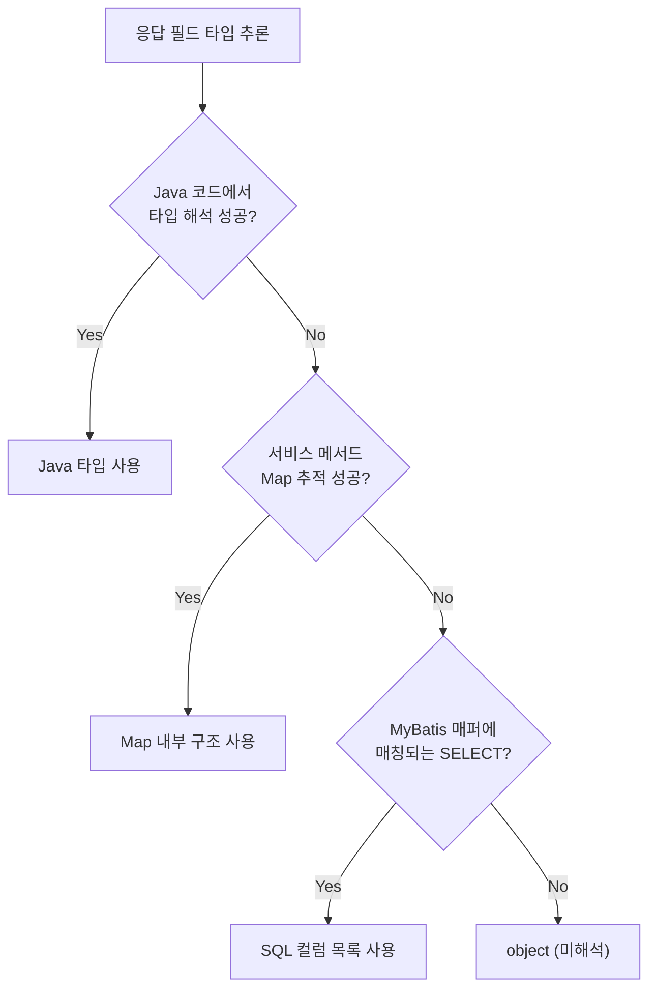

## 역할

Java 코드만으로 응답 타입을 알 수 없을 때, MyBatis XML 매퍼의 SELECT 쿼리에서 컬럼 정보를 추출하여 폴백 소스로 사용한다.

## 파싱 대상

```
src/main/resources/sql/**/*.xml
```

### 추출 항목

| 항목 | 소스 |
|------|------|
| 매퍼 ID | `<select id="findUser">` |
| 결과 타입 | `resultType="camelmap"` / `resultMap="userMap"` |
| SELECT 컬럼 | SQL 문 파싱 |
| resultMap 매핑 | `<resultMap>` property 정의 |

## SQL 컬럼 추출

SELECT 문에서 컬럼명을 추출하되, 여러 SQL 패턴을 처리해야 한다.

### AS 별칭 처리
```sql
SELECT user_name AS userName, created_at AS createdAt
-- → ["userName", "createdAt"]
```

### snake_case → camelCase 자동 변환
```sql
SELECT user_name, created_at
-- resultType="camelmap"이면:
-- → ["userName", "createdAt"]
```

```python
def to_camel_case(snake: str) -> str:
    parts = snake.split('_')
    return parts[0] + ''.join(p.capitalize() for p in parts[1:])
```

### 함수 호출에서 타입 추론
```sql
SELECT COUNT(*) AS totalCount    -- → long
SELECT CASE WHEN ... END AS status  -- → string
SELECT IFNULL(name, '') AS name    -- → string
```

### CTE (WITH ... AS) 스킵
```sql
WITH temp AS (SELECT ...)
SELECT * FROM temp
-- WITH 절은 건너뛰고 최종 SELECT만 파싱
```

## include 참조 해석

MyBatis의 `<include refid="..."/>` 를 먼저 해석해야 완전한 SQL을 얻을 수 있다.

```xml
<sql id="userColumns">
    user_id, user_name, email
</sql>

<select id="findUser" resultType="camelmap">
    SELECT <include refid="userColumns"/>
    FROM users
</select>
```

```python
def resolve_includes(xml_root):
    sql_fragments = {}
    for sql_el in xml_root.findall('.//sql'):
        sql_fragments[sql_el.get('id')] = sql_el.text
    
    for select in xml_root.findall('.//select'):
        for include in select.findall('include'):
            ref = include.get('refid')
            if ref in sql_fragments:
                include.tail = sql_fragments[ref] + (include.tail or '')
```

## resultMap 처리

`resultMap`을 사용하는 경우, property 이름이 컬럼명 대신 사용된다.

```xml
<resultMap id="userMap" type="User">
    <id property="userId" column="user_id"/>
    <result property="userName" column="user_name"/>
    <result property="email" column="email"/>
</resultMap>

<select id="findUser" resultMap="userMap">
    SELECT * FROM users
</select>
```

이 경우 `["userId", "userName", "email"]`을 반환한다.

## 폴백 체인에서의 위치



Java 코드 → Map 추적 → MyBatis 순으로 시도하며, MyBatis는 최후의 보루다. SQL 컬럼만으로는 타입이 정확하지 않지만 (대부분 string으로 처리), 필드명이라도 알면 명세서의 완성도가 올라간다.

## 한계

| 항목 | 상태 |
|------|------|
| 단순 SELECT | 지원 |
| JOIN 결과 | 부분 지원 (별칭 있으면 OK) |
| 서브쿼리 | 최외곽 SELECT만 |
| 동적 SQL (`<if>`, `<choose>`) | 정적 분기 무시, 전체 컬럼 수집 |
| `SELECT *` | 미지원 (컬럼명 모름) |
