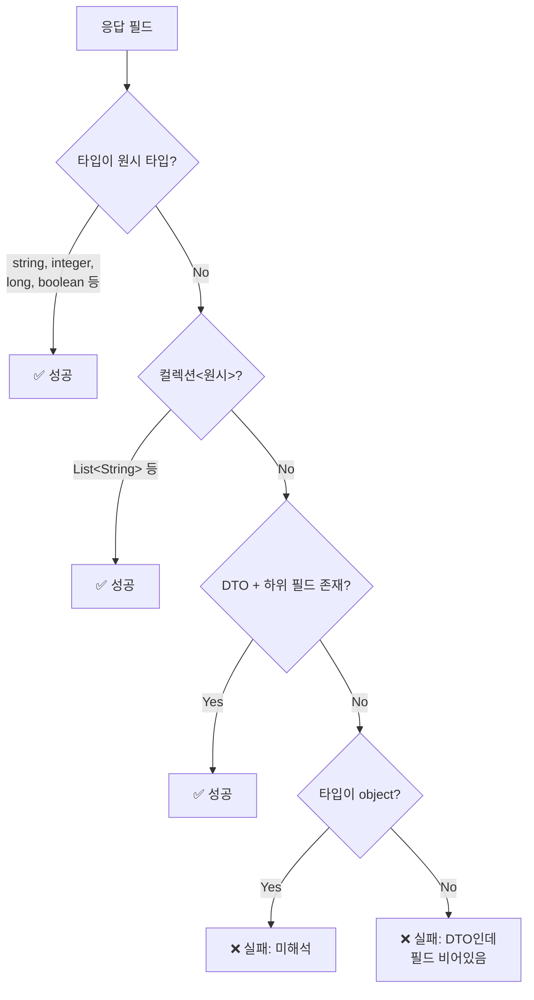
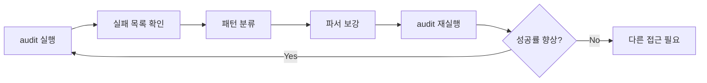

## 목적

자동 생성된 명세서가 얼마나 정확한지 측정한다. "타입 해석 성공률"이라는 단일 지표로 품질을 관리하고, 실패 항목을 분류하여 파서 개선 방향을 제시한다.

## 판정 기준

API 응답의 `data` 영역 필드를 대상으로 성공/실패를 판정한다.



### 성공 조건
- 원시 타입: `string`, `integer`, `long`, `boolean`, `double`, `float`, `file`
- 컬렉션: `List<원시>`, `Set<원시>`, `Collection<원시>`
- DTO: 비원시 타입이면서 하위 필드가 1개 이상 존재

### 실패 조건
- 타입이 `object` 또는 `Object` → 추론 자체가 실패
- DTO인데 하위 필드가 0개 → 클래스 스캔 누락 또는 외부 라이브러리 타입
- 서비스 메서드 추적 실패 → 필드명 앞에 `[putValues]` 마크

## 출력 형태

### 요약 통계
```
총 응답 필드: 342
해석 성공: 318 (93.0%)
해석 실패: 24 (7.0%)
```

### 실패 목록 시트

Excel의 "해석 실패 목록" 시트에 실패 항목을 원인별로 분류한다.

| 엔드포인트 | 필드명 | 현재 타입 | 실패 원인 |
|-----------|--------|----------|----------|
| GET /api/users | data.metadata | object | 타입 미해석 |
| POST /api/orders | data.items | OrderItem | DTO 필드 비어있음 |
| GET /api/stats | [putValues] result | Map | 서비스 추적 실패 |

## 활용 방법

### 점진적 개선 사이클



1. `python -m spec-generator.api.audit` 실행
2. 실패 목록에서 가장 빈도 높은 패턴 확인
3. `type_resolver.py`에 새 패턴 추가
4. 재실행하여 성공률 변화 측정

### 실제 개선 사례

| 추가한 패턴 | 해결된 실패 | 성공률 변화 |
|------------|-----------|------------|
| Stream.map().toList() | 12건 | 85% → 89% |
| Map.of() 키-값 추출 | 8건 | 89% → 91% |
| 2단계 위임 메서드 추적 | 6건 | 91% → 93% |
| MyBatis 폴백 | 5건 | 93% → 94% |

## --trace 옵션

`--trace` 플래그로 실행하면 중간 과정을 7개의 추가 시트로 출력한다.

| 시트명 | 내용 |
|--------|------|
| Step1-java_methods | 스캔된 전체 메서드 목록 |
| Step1-java_classes | 스캔된 전체 클래스 필드 |
| Step1-mybatis_columns | MyBatis에서 추출한 컬럼 목록 |
| Step2-controllers | 감지된 컨트롤러 목록 |
| Step2-service_fields | 컨트롤러의 서비스 필드 매핑 |
| Step3-endpoints | 파싱된 엔드포인트 상세 |
| Step3-res_data 상세 | 응답 data 필드 추론 과정 |

어떤 단계에서 정보가 누락되는지 추적할 때 유용하다. 예를 들어 Step1에서 클래스가 스캔되지 않았으면 scanner 문제이고, Step3에서 타입이 object로 떨어지면 resolver 문제다.

## 핵심 교훈

> 측정할 수 없으면 개선할 수 없다.

자동 생성 도구에서 **성공률 측정 시스템을 처음부터 내장**하면:
- 파서 변경의 영향을 즉시 확인 가능
- 리그레션 감지 (패턴 추가가 다른 곳을 깨뜨릴 때)
- 개선 우선순위 결정 (빈도 높은 실패부터 해결)
