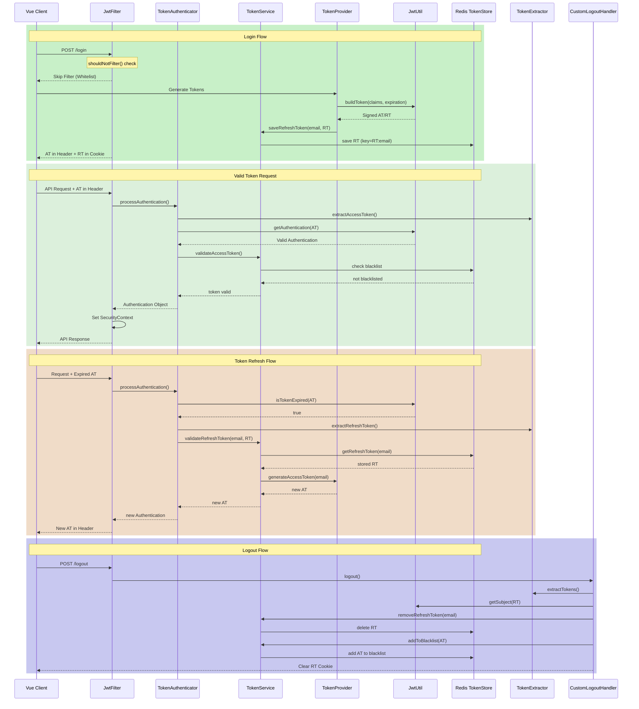

---
tags:
  - security
  - spring
  - springsecurity
  - jwt
draft: false
description:
---
# 인증 과정
1. ID, PW를 통해 인증시 AccessToken(AT)과 RefreshToken(RT)을 반환
2. 이후 인증이 필요한 모든 요청에 대하여 AccessToken 검증 작업 
	1. 만료된 경우: RT 검증
		1. 유효한 RT: AT 재발급
		2. 만료되거나 로그아웃된 RT인 경우 에러 처리
	2. 유효한 경우: IoC Container 내부로 API 요청 전달

# Spring Security

### Configuration

#### 1. Security Properties
> application.yml에 작성된 변수 저장(SecretKey 제외)
```Java
@RequiredArgsConstructor  
@Getter
@ConfigurationProperties("security")  
public class SecurityProperties {  
    private final long accessExpirationTime;  
    private final long refreshExpirationTime;  
    private final List<String> skipPaths;   
}
```
#### 2. JWT Util
> application.yml에 저장된 secretKey를 저장하는 유일한 Component<br/>
> secretKey가 필요한 작업은 타 컴포넌트에서 jwtUtil을 의존성 주입 받아 진행

```Java title="TokenProvider.java"
private String buildToken(Claims claims, Long expiration) {  
    return jwtUtil.signToken(Jwts.builder()  
            .setClaims(claims)  
            .setIssuedAt(new Date())  
            .setExpiration(new Date(System.currentTimeMillis() + expiration)));  
  
}
```
#### 3. WebSecurity
1. SecurityProperties에 정의된 SkipPaths는 인증 없이 통과
2. Spring Security Filter Chain에 Authentication Filter(ID, Password로 로그인하는) 추가
3. AuthenticationFilter 전에 JWT 필터 추가

### Exception Handling
> Spring Security Filter Chain은 IoC Container 외부에서 작동하는 점을 고려하여 Global Exception Handler와 별개로 Security Exception, SecurityErrorCode, SecurityExceptionHandler를 작성하여 예외를 처리하였음

```Java title="TokenAuthenticator.java"
String refreshToken = tokenExtractor.extractRefreshToken(request);  
if (refreshToken == null || refreshToken.isEmpty()) {  
    log.debug("No refresh token found");  
    throw new SecurityException(SecurityErrorCode.REFRESH_TOKEN_NOT_FOUND);  
}
```
이렇게 발생한 SecurityException은 SecurityExceptionHandler를 통해 에러 응답을 바로 반환함
```Java title="JwtFilter.Java"
catch (SecurityException e){  
    securityExceptionHandler.handleSecurityException(request, response, e.getErrorCode());  
}
```


### Response Handling
> Security 관련 요청(login, 새로 고침)의 경우 SecurityFilterChain 내에서 응답을 바로 전달할 수 있도록 SecurityResponseHandler을 통해 응답을 반환하였음

```Java title="JwtFilter.Java"
if(request.getRequestURI().equals("/api/users/refresh")){  
        securityResponseHandler.onAuthenticationSuccess(request, response, authentication);  
    }  
  
        SecurityContextHolder.getContext().setAuthentication(authentication);  
        log.debug("Authentication set in SecurityContext: {}", authentication);  
  
}
```

```Java title="AuthenticationFilter.Java"
@Override  
protected void successfulAuthentication(  
        HttpServletRequest request,  
        HttpServletResponse response,  
        FilterChain chain,  
        Authentication authResult  
) throws IOException, ServletException {  
        securityResponseHandler.onAuthenticationSuccess(request, response ,authResult);  
}
```
### JWT LifeCycle



