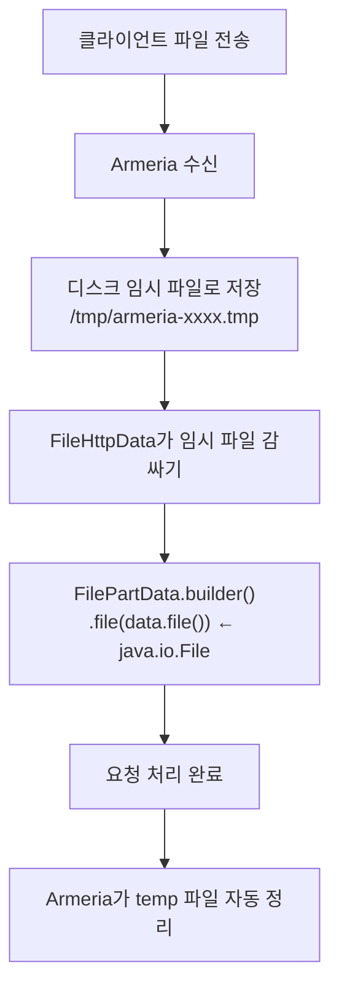

## 질문

Armeria 기반 서버에서 멀티파트 파일 업로드를 받을 때, `FilePartData` 객체 안의 파일은 메모리에 있는 건지, 디스크에 있는 건지?

## 답변

### 파일은 디스크(temp)에 저장된다

Armeria는 클라이언트가 전송한 파일을 **메모리가 아닌 디스크의 임시 파일**로 저장한다.



### FilePartData 빌드 과정

```java
FileHttpData data = (FileHttpData) bodyPart.content();
FilePartData p = FilePartData.builder()
        .multipartMode(MultipartMode.TRANSFER)
        .inputStream(data.toInputStream())   // 디스크 파일 읽는 스트림
        .file(data.file())                   // 예: /tmp/armeria-xxxx.tmp
        .fileName(filename)                  // 원본 파일명
        .size((int) data.file().length())    // 파일 크기
        .contentType(bodyPart.contentType()) // Content-Type
        .name(bodyPart.name())               // multipart field name
        .build();
```

### 핵심 정리

| 항목 | 설명 |
|------|------|
| `dto.getFile().getFile()` | `/tmp/armeria-xxxxx.tmp` 같은 실제 디스크 파일 |
| `dto.getFile().getInputStream()` | 디스크 파일을 읽는 스트림 |
| 저장 위치 | 메모리가 아닌 **디스크 temp 디렉토리** |
| 정리 시점 | 요청 처리 완료 후 Armeria가 자동 정리 |

대용량 파일도 처리할 수 있도록 디스크 임시 파일로 쓴 뒤 경로를 참조하는 방식이다. byte[]로 메모리에 올리면 OOM 위험이 있기 때문.
