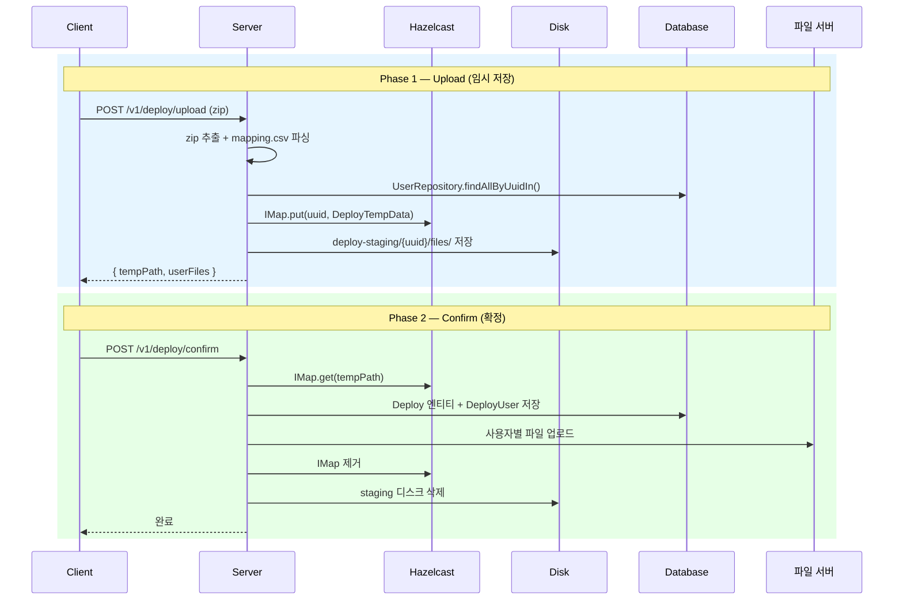

## 배경

파일 업로드 및 게시 시스템에서 관리자 승인 전까지 임시 데이터를 저장해야 하는 요구사항이 발생했다. 기존에는 업로드 즉시 DB 저장 + 파일 서버 업로드를 수행했지만, 관리자가 사용자-파일 매핑을 확인 후 승인하는 2단계 프로세스로 변경이 필요했다.

## 저장해야 하는 데이터

- **메타데이터**: 게시 정보(fileVer, deployDt, expireDt 등) + 사용자-파일 매핑 목록
- **바이너리**: zip에서 추출된 실제 업로드 파일들

## 저장 방식 비교

### 1. Hazelcast IMap (분산 캐시)

프로젝트에 이미 Hazelcast 4.2가 DEPLOY 클러스터로 구성되어 있었다.

- 장점: 다중 인스턴스 자동 공유, TTL 자동 만료(24h), 빠른 접근
- 단점: 바이너리 파일 저장에는 부적합 (메모리 압박), Serializable 필요
- 적합: 메타데이터 저장

### 2. JSON 파일 (디스크)

deploy.json, user-file-map.json 형태로 디스크에 직렬화.

- 장점: 서버 재시작에도 유지, 대용량 처리 가능
- 단점: 디스크 I/O, 분산 환경에서 공유 스토리지 필요, TTL 직접 구현
- 적합: 단일 인스턴스 환경

### 3. ConcurrentHashMap (로컬 메모리)

가장 단순한 in-memory 방식.

- 장점: 구현 최소, 접근 최빠름
- 단점: 서버 재시작 시 유실, 분산 불가, TTL 직접 구현
- 적합: 프로토타입/테스트

### 4. Guava Cache (로컬 메모리 + TTL)

`expireAfterWrite` 기반 자동 만료 지원.

- 장점: TTL 내장, 기존 Guava 의존성 활용
- 단점: 분산 불가, 서버 재시작 시 유실
- 적합: 단일 인스턴스 + TTL 필요 시

## 최종 선택: Hazelcast IMap + 디스크 하이브리드

```
[메타데이터]  Hazelcast DEPLOY 클러스터 IMap<String, DeployTempData>
              - key: UUID (tempPath)
              - value: 게시 정보 + 사용자-파일 매핑
              - TTL: 86400s (24h, hazelcast.yml 기본값)

[바이너리]    {config.file.prefix}/deploy-staging/{uuid}/files/
              - 추출된 실제 업로드 파일들
```

### 선택 이유

1. **기존 인프라 활용**: DEPLOY 클러스터가 이미 구성되어 있어 추가 설정 최소화
2. **분산 환경 지원**: upload 요청은 인스턴스 A, confirm 요청은 인스턴스 B로 갈 수 있음 → Hazelcast가 자동 해결
3. **TTL 자동 관리**: hazelcast.yml에 24h 설정 → 메타데이터용 별도 cleanup 스케줄러 불필요
4. **코드 단순화**: JSON 파일 직렬화/역직렬화 제거, `IMap.put()/get()` 으로 단순 접근

### 주의사항

- DTO에 `Serializable` 구현 필수 (Hazelcast IMap 직렬화)
- 디스크 파일은 Hazelcast TTL과 별도로 `@Scheduled` 스케줄러로 정리 필요
- Hazelcast 전체 재시작 시 메타데이터 유실 가능 → 디스크 파일 orphan 발생, cleanup 스케줄러가 처리

## 구현 구조

### 생성한 파일

| 파일 | 역할 |
|------|------|
| `UserFileDto.java` | 사용자-파일 매핑 DTO (Serializable) |
| `DeployTempData.java` | Hazelcast IMap value — 메타데이터 + UserFileDto 목록 통합 |
| `DeployTempStorageService.java` | zip 추출, mapping.csv 파싱, Hazelcast + 디스크 저장/조회/삭제 |
| `DeployStagingCleanupScheduler.java` | @Scheduled(1h) 디스크 파일 TTL 정리 |

### 수정한 파일

| 파일 | 변경 |
|------|------|
| `Deploy.java` | maxDownloadCnt, userCnt 필드 추가 (DB 컬럼 이미 존재) |
| `DeployService.java` | confirmDeployment() 추가 — DB 저장 + 파일 서버 업로드 |
| `DeployController.java` | upload() 변경 (temp 저장) + confirm() 추가 |
| `application-*.yml` | config.deploy.staging.base-path, ttl-hours 추가 |

### 구현 흐름



```
Phase 1 (POST /v1/deploy/upload)
  zip 추출 → mapping.csv 파싱 → UserRepository.findAllByUuidIn()
  → Hazelcast IMap.put(uuid, DeployTempData)
  → 디스크 deploy-staging/{uuid}/files/ 에 파일 저장
  → 응답: { tempPath, userFiles }

Phase 2 (POST /v1/deploy/confirm)
  Hazelcast IMap.get(tempPath) → DeployTempData 조회
  → Deploy 엔티티 생성 (maxDownloadCnt, userCnt 포함) → DB 저장
  → 사용자별 파일 서버 업로드 + DeployUser/History 저장
  → Hazelcast 제거 + 디스크 삭제
```

### Zip 파일 구조

```
upload.zip
  mapping.csv        ← user_uuid,file_name (헤더 포함 CSV)
  file_01.txt        ← 실제 업로드 파일 (flat 구조)
  file_02.txt
```

## 구현 중 만난 이슈

### 1. Hazelcast DEPLOY 클러스터 미등록

local 환경에서는 `COMMON` 클러스터만 등록되어 있어 `hazelcastInstances.get(Cluster.DEPLOY)`가 null 반환.

```java
// fallback 처리
HazelcastInstance hz = hazelcastInstances.get(Cluster.DEPLOY);
if (hz == null) hz = hazelcastInstances.get(Cluster.COMMON);
return hz.getMap(IMAP_NAME);
```

### 2. Armeria MultipartFile 비동기 기록 문제

Armeria의 `MultipartFile.path()`가 `AsyncFileWriter`로 비동기 기록 중인 temp 파일을 반환하여 zip 추출 시 0 bytes. Controller에서 `file.file()`을 `File`로 전달하여 해결. (별도 글 참고: 006)

### 3. 파일 저장 경로 권한 문제

운영 서버 전용 경로는 로컬에서 접근 불가. `config.deploy.staging.base-path` 프로퍼티를 분리하여 local은 `./storage`, production은 원래 경로 사용.

## 교훈

1. 메타데이터와 바이너리는 저장 전략을 분리하는 것이 효과적
2. 기존 인프라(Hazelcast)를 최대한 활용하면 구현 복잡도 대폭 감소
3. Hazelcast 클러스터 등록 여부는 환경별로 다를 수 있으므로 fallback 필수
4. DTO에 `Serializable` 구현과 `serialVersionUID` 명시 필수 (Hazelcast 직렬화)
