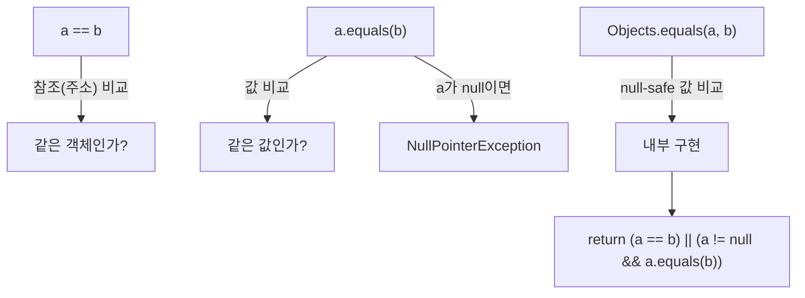

## 배경

2단계 배포 프로세스에서 **upload**(파일 업로드 + 임시 저장) → **confirm**(승인 + DB 저장)으로 분리된 구조를 사용한다. 이때 upload한 사용자와 confirm 요청 사용자가 동일한지 검증이 필요하다.

## 문제

`confirm` API에서 Hazelcast에 캐싱된 `DeployTempData`를 조회한 후, 별도 검증 없이 현재 사용자의 ID로 `regId`를 덮어쓰고 있었다. 다른 사용자가 `tempPath`만 알면 타인의 배포를 승인할 수 있는 문제.

## 해결

```java
DeployTempData tempData = deployTempStorageService.getTempData(tempPath);

// 업로드한 사용자와 승인 요청 사용자가 동일한지 검증
if (!Objects.equals(tempData.getRegId(), userId)) {
    throw new IllegalArgumentException("Invalid request: user mismatch");
}
```

## Objects.equals() vs == vs .equals()



| 비교 방식 | null-safe | 비교 대상 | 사용 시점 |
|-----------|-----------|-----------|-----------|
| `==` | O | 참조(주소) | primitive, enum |
| `.equals()` | X | 값 | null 아닌 게 확실할 때 |
| `Objects.equals()` | O | 값 | **일반적 권장** |

### Long 타입 주의사항

```java
Long a = 127L;
Long b = 127L;
a == b  // true (Long 캐시 범위 -128~127)

Long c = 128L;
Long d = 128L;
c == d  // false! (캐시 범위 밖 → 새 객체)

Objects.equals(c, d)  // true (값 비교)
```

`Long`은 -128~127 범위만 캐싱하므로, `==`로 비교하면 범위 밖의 값은 항상 `false`가 된다. **반드시 `Objects.equals()` 또는 `.equals()`를 사용해야 한다.**

## 핵심 정리

- 2단계 프로세스(upload → confirm)에서는 **요청 간 사용자 일치 검증**이 필수
- Wrapper 타입(`Long`, `Integer` 등) 비교에는 `Objects.equals()` 사용
- `==`는 primitive와 enum에서만 안전
