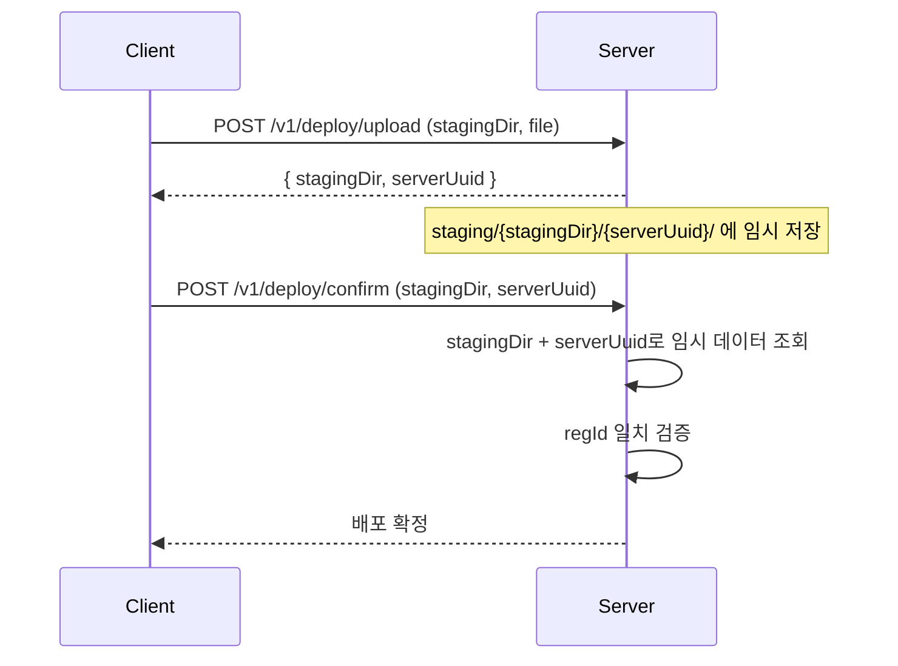
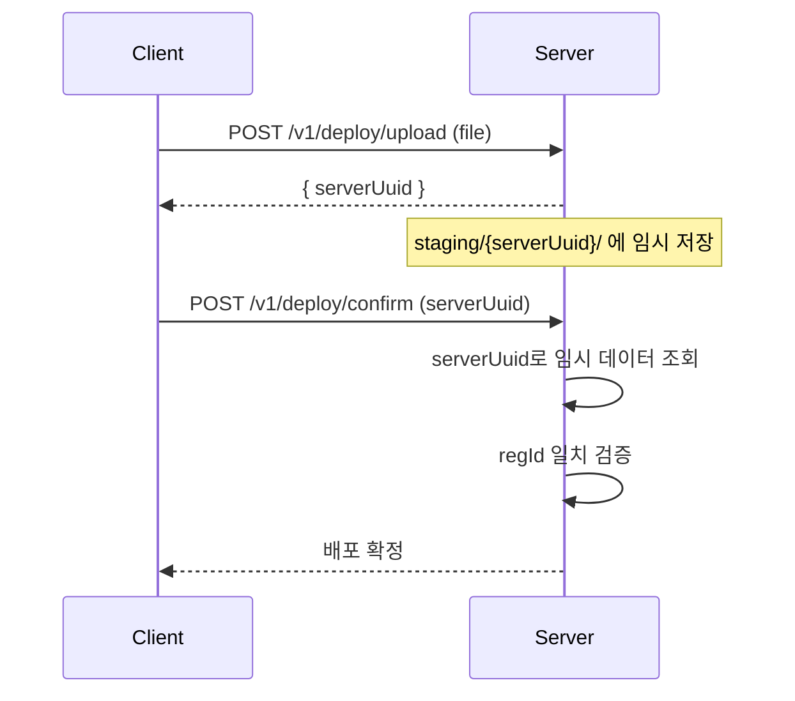
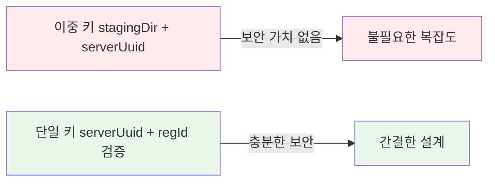

## 배경

배포 파일 업로드 → 확인(confirm) 과정에서 임시 데이터를 식별하기 위한 키 전략을 비교한다.

### 현재 구조: 이중 키

| 키 | 출처 | 역할 |
|---|---|---|
| `stagingDir` | 클라이언트 제공 (기본값 "default") | 디렉토리 파티션 |
| `serverUuid` | 서버 생성 UUID v4 | 고유 식별자 |

추가로 confirm 시 `regId`(등록자 ID) 일치 검증도 수행한다.

### 비교 대상: 단일 키 (serverUuid만)

## 분석

### stagingDir이 보안 가치를 제공하지 못하는 이유

1. **클라이언트 제공 값은 비밀이 아님** — 요청자가 이미 아는 값이므로 공격자가 탈취할 경우 serverUuid와 동시에 노출됨
2. **기본값 "default"** — 대부분의 요청이 동일한 값을 사용할 가능성이 높아 식별 기능 약화
3. **엔트로피 추가 없음** — 예측 가능한 값(사용자 입력)은 무작위성을 더하지 않음

### serverUuid 단독 사용이 충분한 이유

| 관점 | 설명 |
|---|---|
| **추측 방어** | UUID v4 = 122비트 엔트로피, 무차별 대입 불가능 |
| **소유권 검증** | `regId` 일치 확인이 진짜 보안 장치 역할 |
| **경로 단순화** | `staging/{serverUuid}/` 한 단계로 충분 |
| **API 간소화** | 요청/응답에서 불필요한 필드 제거 |

### 이중 키가 의미 있으려면

stagingDir이 보안 가치를 가지려면 **서버가 생성한 별도의 비밀 값**이어야 한다. 하지만 그 경우 서버 랜덤키 두 개를 사용하는 것이 되며, UUID 하나의 엔트로피로 이미 충분하므로 실익이 없다.

## 결론

- **serverUuid + regId 검증** 조합이면 보안과 식별 모두 충분
- stagingDir을 제거하면 API 인터페이스, 파일 경로, 클라이언트 로직이 모두 단순해짐
- 불필요한 키는 코드 복잡도와 유지보수 비용만 증가시킴
