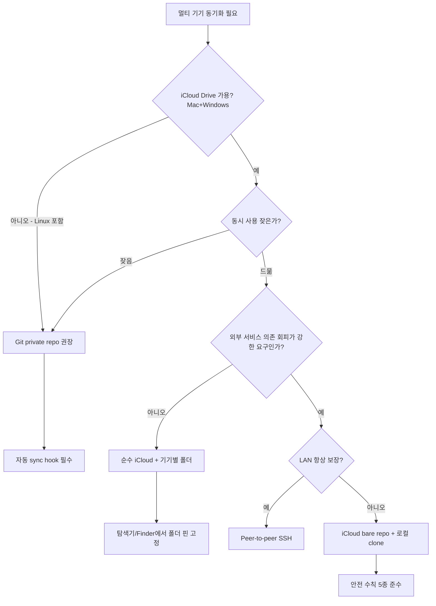

여러 대의 기기(Mac 여러 대, 또는 Mac과 Windows 혼합)에서 같은 Claude Code 환경을 쓰려고 보니, `~/.claude/` 안의 데이터를 어떻게 공유할지가 문제였다. 단순히 "iCloud에 통째로 올리고 심볼릭 링크"가 첫 번째 떠오르는 발상이지만, 막상 파보면 캐시·세션·로그가 섞여 있어 그대로 옮기면 Claude가 깨진다. 이 글은 의사결정 과정을 통해 **무엇을 공유하고 무엇은 절대 공유하면 안 되는지**, 그리고 동기화 매체로 **iCloud · Git · 둘의 하이브리드** 중 어떤 게 최적인지를 정리한 기록이다.

## 출발: `~/.claude/` 안의 데이터 분류

`~/.claude/`에 있는 항목들을 들여다보면 셋으로 나뉜다.

| 계층               | 예시                                                                                                   | 성격                      |
| ------------------ | ------------------------------------------------------------------------------------------------------ | ------------------------- |
| **공유 가치 있음** | `CLAUDE.md`, `qa-history/`                                                                             | 사람의 자산 (지침·이력)   |
| **공유 무의미**    | `plans/`, `tasks/`, `todos/`                                                                           | 진행 중 세션 부산물       |
| **공유 절대 금지** | `sessions/`, `cache/`, `paste-cache/`, `projects/`, `history.jsonl`, `settings.local.json`, `plugins/` | 기기별 세션·캐시·바이너리 |

이 분류가 모든 결정의 출발점이다. 동기화 매체를 무엇으로 고르든, **공유 금지 카테고리는 절대 건드리지 않는다**. 권한 정보가 꼬이거나 세션 상태가 손상되면 Claude Code 자체가 죽는다.

따라서 실제로 iCloud에 둘 대상은 두 가지다. 단, 둘의 **취급 방식이 다르다**.

- `qa-history/` — 매일 append되는 Q&A 로그. 누적되며 가치가 커진다. 기기별 폴더로 격리해 두지만, 블로그 합성 시엔 **모든 기기 폴더를 함께 읽는다**(cross-device read).
- `CLAUDE.md` — 전역 지침. 24KB, 거의 안 바뀐다. 이쪽은 **기기별로 완전히 독립**시킨다. iCloud엔 백업·접근 목적으로만 두고, 한 기기의 변경을 다른 기기로 옮길 땐 수동 복붙하거나 그때그때 Claude에게 부탁한다. 단일 공유 파일로 두지 않는 이유는 뒤의 "회고"에서 다룬다.

## 후보 매체 비교

### 1) iCloud Drive + 심볼릭 링크

가장 단순. iCloud Drive 안에 `claude-shared/`를 두고 `~/.claude/`의 일부를 심볼릭 링크.

- 장점: 셋업 후 워크플로 0. 파일 저장 즉시 백그라운드 sync.
- 함정: "Mac 저장공간 최적화"가 켜져 있으면 자주 안 쓰는 파일이 evict되어 placeholder만 남는다. Claude 시작 시 네트워크 대기 또는 실패.
- 함정: 두 기기 동시 사용 시 `qa-history/YYYY-MM-DD.md`에 양쪽이 append → iCloud 충돌 사본(`-conflicted` 또는 `(기기명에서)`) 생성. 데이터 손실은 아니지만 정리 부담.

### 2) Git private repo

`CLAUDE.md`와 `qa-history/`를 git으로 관리. 원격은 GitHub private repo, 또는 자가 호스팅, 또는 로컬만.

- 장점: 명시적 merge, 완전한 history, 어디서나 접근.
- 함정: `qa-history`는 매일 append되는 로그. 매 Q&A마다 commit하면 noise, daily flush로 묶으면 sync 지연. 자동화 없으면 사람 의존도 높음.

### 3) `.git` 자체를 iCloud에 두는 발상

"git의 workflow는 쓰면서, GitHub 같은 외부 서비스도 안 쓰고 싶다" → `.git/`을 iCloud에 두고 main 브랜치를 통합점으로.

이 발상은 **위험하다**. git은 트랜잭션을 가정한다. `.git/index.lock`, refs, pack 파일이 한 단위로 일관되게 변해야 하는데, iCloud는 파일별 비동기 sync다. commit 도중 일부 객체만 sync되면 다른 기기는 dangling 상태로 본다(`error: missing object`). pack 파일이 evict되어도 깨진다. Dropbox·OneDrive·iCloud + `.git` 조합은 수년간 corruption 사례가 누적된 알려진 안티패턴.

다만 **bare repo만** iCloud에 두는 변형은 race 영역이 좁아진다. 작업 tree는 각 기기 로컬, iCloud엔 `.git/`만. push/fetch 순간만 iCloud 접촉한다.

## 의사결정 흐름



가장 많은 케이스(Mac 2~3대 또는 Mac+Windows 혼합, 동시 사용 드묾, GitHub 사용 가능)는 **F안: 순수 iCloud + 기기별 폴더 격리**가 정답이다. iCloud Drive는 Windows에도 공식 클라이언트가 있어 Mac+Windows 혼합 환경에서도 동일 전략이 적용 가능하다.

## 충돌을 구조적으로 없애는 핵심 트릭

어떤 매체를 고르든 한 가지 트릭이 모든 충돌을 거의 0으로 만든다.

**공유 데이터를 전부 기기별 하위 폴더로 격리**한다 — `CLAUDE.md`도, `qa-history/`도.

```
claude-shared/
├── config/
│   ├── macbook-pro/CLAUDE.md       ← 이 기기만 씀
│   └── imac/CLAUDE.md              ← 저 기기만 씀
└── qa-history/
    ├── macbook-pro/2026-05-13.md   ← 이 기기만 씀
    └── imac/2026-05-13.md          ← 저 기기만 씀
```

각 기기는 자기 폴더에만 쓰므로 **같은 파일을 두 기기가 동시에 수정하는 시나리오 자체가 사라진다**. iCloud든 git이든 충돌이 안 난다. 단일 공유 파일이 하나도 없으니 충돌 가능성이 구조적으로 0이다.

읽기 정책만 둘이 다르다. `qa-history/`는 블로그 합성 같은 "여러 날·여러 기기 종합" 작업 시 모든 기기 폴더를 같이 읽는다 — CLAUDE.md의 합성 절차 한 줄을 `qa-history/*/YYYY-MM-DD.md`로 글로빙하도록 수정하면 자동 처리된다. 반면 `CLAUDE.md`는 각 기기가 **자기 것만** 쓰며, 다른 기기 버전을 끌어올지는 필요할 때 수동으로 결정한다.

## 추천 셋업: 순수 iCloud + 기기별 폴더

가장 단순하고 가장 안정적인 조합.

### macOS (bash/zsh)

```bash
ICLOUD="$HOME/Library/Mobile Documents/com~apple~CloudDocs/claude-shared"
CLAUDE="$HOME/.claude"

# 옵션 A: ComputerName 기반 (가독성 우선, 충돌 위험 약간 존재)
DEVICE=$(scutil --get ComputerName | tr ' ' '-' | tr '[:upper:]' '[:lower:]')

# 옵션 B: 하드웨어 시리얼 기반 (충돌 0, 권장)
# 주의: `ioreg -l`은 레지스트리 전체를 덤프해 바이너리 바이트가 섞여 들어가는데,
# UTF-8 로케일에선 awk가 이를 변환하다 `towc: multibyte conversion failure`를 뱉는다.
# 노드 하나(-rd1 -c IOPlatformExpertDevice)로 범위를 좁히고, LC_ALL=C로 raw 바이트 처리.
# SERIAL=$(ioreg -rd1 -c IOPlatformExpertDevice | LC_ALL=C awk -F'"' '/IOPlatformSerialNumber/{print $4}')
# MODEL=$(sysctl -n hw.model | sed 's/[0-9,]//g')   # Macmini, MacBookPro 등
# DEVICE="${MODEL}-${SERIAL}"                        # 예: Macmini-XXXXXXXXXX

# 백업
cp -R "$CLAUDE" "$CLAUDE.backup-$(date +%Y%m%d)"

# CLAUDE.md — 기기별 격리 (공유 아님, iCloud엔 백업·접근용으로만)
# 파일이므로 DEVICE 폴더를 먼저 만들고 그 "안으로" 옮긴다.
mkdir -p "$ICLOUD/config/$DEVICE"
mv "$CLAUDE/CLAUDE.md" "$ICLOUD/config/$DEVICE/CLAUDE.md"
ln -s "$ICLOUD/config/$DEVICE/CLAUDE.md" "$CLAUDE/CLAUDE.md"

# qa-history — 기기별 격리
# 주의: 디렉토리는 타겟을 미리 만들면 mv가 그 "안에" 넣어버려 한 단계 더 깊어진다.
mkdir -p "$ICLOUD/qa-history"   # 부모만 — DEVICE 폴더는 mv가 만든다
mv "$CLAUDE/qa-history" "$ICLOUD/qa-history/$DEVICE"
ln -s "$ICLOUD/qa-history/$DEVICE" "$CLAUDE/qa-history"
```

> 사전 체크: ① Claude Code 종료, ② iCloud Drive 활성화 확인 (`ls "$HOME/Library/Mobile Documents/com~apple~CloudDocs/"`), ③ 옵션 B를 쓰려면 주석을 직접 토글.

**이 스크립트는 모든 기기에서 동일하다.** CLAUDE.md·qa-history 모두 "로컬 본을 자기 DEVICE 폴더로 옮기고 심볼릭 링크"만 하므로, 두 번째·세 번째 기기도 자기 이름의 폴더를 새로 만들 뿐 다른 기기 폴더와 절대 겹치지 않는다. CLAUDE.md를 단일 공유 파일로 두던 이전 설계에선 "두 번째 기기는 이미 iCloud에 파일이 있으니 `mv` 대신 `rm`+링크"라는 예외 분기가 필요했는데, 기기별 격리로 바꾸면서 그 분기 자체가 사라졌다. (단, 두 번째 기기에서 첫 기기의 CLAUDE.md를 출발점으로 쓰고 싶다면, 위 `mv` 전에 `cp "$ICLOUD/config/<첫기기>/CLAUDE.md" "$CLAUDE/CLAUDE.md"`로 한 번 복사해 오면 된다.)

### Windows (PowerShell)

집에서는 Windows를 쓰는 등 Mac+Windows 혼합 환경이면 같은 iCloud 폴더를 Windows에서도 마운트해 동일 전략을 쓴다. Apple이 제공하는 [iCloud for Windows](https://support.apple.com/icloud-for-windows) 설치가 전제.

```powershell
$ICLOUD = "$env:USERPROFILE\iCloudDrive\claude-shared"
$CLAUDE = "$env:USERPROFILE\.claude"

# 옵션 A: ComputerName 기반
$DEVICE = $env:COMPUTERNAME.ToLower()

# 옵션 B: 하드웨어 시리얼 기반 (권장)
# $SERIAL = (Get-CimInstance Win32_BIOS).SerialNumber
# $MODEL  = (Get-CimInstance Win32_ComputerSystem).Model -replace '[\s,]', ''
# $DEVICE = "$MODEL-$SERIAL"   # 예: OptiPlex7090-ABCD1234

# 백업
Copy-Item -Recurse $CLAUDE "$CLAUDE.backup-$(Get-Date -Format yyyyMMdd)"

# CLAUDE.md — 기기별 격리 (파일은 SymbolicLink, 관리자 권한 또는 개발자 모드 필요)
New-Item -ItemType Directory -Force -Path "$ICLOUD\config\$DEVICE" | Out-Null
Move-Item "$CLAUDE\CLAUDE.md" "$ICLOUD\config\$DEVICE\CLAUDE.md"
New-Item -ItemType SymbolicLink -Path "$CLAUDE\CLAUDE.md" -Target "$ICLOUD\config\$DEVICE\CLAUDE.md"

# qa-history 기기별 격리 — DEVICE 폴더는 Move-Item이 생성. 미리 만들면 안 됨.
New-Item -ItemType Directory -Force -Path "$ICLOUD\qa-history" | Out-Null   # 부모만
Move-Item "$CLAUDE\qa-history" "$ICLOUD\qa-history\$DEVICE"
New-Item -ItemType Junction -Path "$CLAUDE\qa-history" -Target "$ICLOUD\qa-history\$DEVICE"
```

Windows에서 주의할 점:

- **링크 권한 차이**: 파일 `SymbolicLink`는 관리자 권한 또는 *설정 → 개발자용 → 개발자 모드*가 필요. 디렉터리는 `Junction`을 쓰면 권한 없이 가능 → 위 예시는 `qa-history`에 Junction 사용
- **iCloud 경로**: `%USERPROFILE%\iCloudDrive\` (Microsoft Store판 / 클래식판 동일)
- **항상 보관**: 파일 탐색기에서 폴더 우클릭 → "이 장치에 항상 보관" (macOS의 "이 Mac에 항상 보관"과 동일 역할)
- **iCloud for Windows 안정성**: macOS 네이티브보다 sync 지연이 길고 가끔 fail. 동시 사용 자제 권고가 더 중요

### 셋업 검증

스크립트를 돌린 뒤 세 가지만 확인하면 된다: ① `DEVICE`가 의도대로 잡혔는가, ② `~/.claude`의 링크가 iCloud 실데이터를 가리키는가, ③ 백업 사본과 클라우드 업로드가 살아 있는가.

```bash
# ① DEVICE 값 — 시리얼 조합이면 'Macmini-XXXXXXXXXX' 형태여야 한다 (빈 값이면 옵션 B 추출 실패)
echo "$DEVICE"

# ② 링크 정상 여부 — 둘 다 '-> .../claude-shared/...' 화살표가 보여야 한다
ls -la ~/.claude/CLAUDE.md ~/.claude/qa-history

# 링크가 실제로 열리는지(타겟이 내려와 있는지)까지 확인 — 깨진 링크면 에러가 난다
cat ~/.claude/CLAUDE.md >/dev/null && echo "CLAUDE.md OK"
ls  ~/.claude/qa-history >/dev/null && echo "qa-history OK"

# ③ 로컬 백업 사본 존재 (되돌릴 안전망)
ls -d ~/.claude.backup-*
```

iCloud 폴더 구조는 `config/`·`qa-history/` 양쪽에 **같은 DEVICE 폴더 하나씩**이 있으면 정상이다(`tree`로 확인).

```
claude-shared/
├── config/
│   └── Macmini-XXXXXXXXXX/
│       └── CLAUDE.md
└── qa-history/
    └── Macmini-XXXXXXXXXX/
        ├── 2026-04-02.md
        └── ...
```

클라우드 업로드 완료 여부:

```bash
# 출력이 비면 업로드 완료. 'upload' 줄이 남아 있으면 아직 올리는 중이다.
ICLOUD="$HOME/Library/Mobile Documents/com~apple~CloudDocs/claude-shared"
brctl status "$ICLOUD" 2>/dev/null | grep -i upload
```

Finder에서 `claude-shared`의 파일 옆 **구름 아이콘이 사라졌는지**로도 같은 걸 확인할 수 있다.

Windows에서는 PowerShell로 링크 타입·타겟을 본다.

```powershell
echo $DEVICE
Get-Item $env:USERPROFILE\.claude\CLAUDE.md, $env:USERPROFILE\.claude\qa-history |
  Select-Object Name, LinkType, Target          # LinkType이 SymbolicLink/Junction, Target이 iCloud 경로면 정상
Get-ChildItem -Directory "$env:USERPROFILE\.claude.backup-*"
```

검증이 모두 통과하면 마지막으로 `claude-shared`에 "항상 보관" 핀을 걸고(안전 수칙 #1), 며칠 정상 동작을 확인한 뒤 백업 사본을 지운다.

**흔한 실패 신호와 원인**

| 증상 | 원인 | 대응 |
| --- | --- | --- |
| `ls -la`에 화살표 없이 일반 파일/폴더로 보임 | 링크가 아니라 실파일이 로컬에 남음 (셋업이 중간에 끊김) | 백업 사본에서 복구 후 재실행 |
| 화살표는 있는데 `cat`이 `No such file` | iCloud 타겟이 아직 안 내려왔거나 evict됨 | "항상 보관" 핀 + 잠시 대기 |
| `qa-history/<DEVICE>/qa-history`처럼 한 단계 더 깊게 생성됨 | `mv` 전에 타겟 디렉토리를 미리 만든 경우(앞서 경고한 `mv` 함정) | 깊어진 폴더를 한 단계 끌어올리고 링크 재생성 |
| `echo "$DEVICE"`가 빈 값 | 옵션 B 시리얼 추출 실패(awk 로케일 등) | 위 수정된 시리얼 명령으로 다시 잡고 재실행 |

### DEVICE 식별자 선택

| OS      | 방식                                                    | 예시                   | 충돌 가능성                                | 비고                                         |
| ------- | ------------------------------------------------------- | ---------------------- | ------------------------------------------ | -------------------------------------------- |
| macOS   | `scutil --get ComputerName`                             | `macbook-pro`          | 있음 (사용자가 같은 이름으로 설정 가능)    | Time Machine 복원·마이그레이션으로 복제 위험 |
| macOS   | `IOPlatformSerialNumber` + `hw.model`                   | `Macmini-XXXXXXXXXX`   | 0 (하드웨어 시리얼)                        | OS 재설치·이름 변경에 영향 없음, **권장**    |
| Windows | `$env:COMPUTERNAME`                                     | `desktop-home`         | 있음 (이미지 복제·도메인 환경에서 충돌)    | 가장 쉬움                                    |
| Windows | `Win32_BIOS.SerialNumber` + `Win32_ComputerSystem.Model` | `OptiPlex7090-ABCD1234` | 0 (BIOS 시리얼)                            | 일부 자작 PC는 시리얼이 비어있을 수 있음, **권장** |

ComputerName 방식은 폴더명이 짧고 어느 기기인지 한눈에 들어오지만, **두 기기에 같은 이름이 들어가면 격리 트릭이 조용히 무력화**된다. 시리얼 방식은 폴더명이 길어지는 대신 충돌이 물리적으로 불가능하다. 이 글의 "구조적으로 충돌을 없앤다"는 컨셉을 끝까지 지키려면 시리얼 방식이 더 부합한다.

### iCloud 안전 수칙

1. **항상 보관 고정** — macOS는 Finder, Windows는 파일 탐색기에서 `claude-shared` 폴더 우클릭 → "이 Mac/장치에 항상 보관". 전역 "저장공간 최적화"는 켜둬도, 이 폴더만 evict 대상에서 제외된다. 일부 폴더만 핀 고정하는 게 핵심.
2. **CLAUDE.md 변경은 수동 전파** — 기기별로 독립이므로 한 기기에서 지침을 고쳐도 다른 기기엔 자동 반영되지 않는다. 의도된 동작이다. 옮기고 싶을 때만 복붙하거나 Claude에게 "다른 기기 CLAUDE.md 내용 반영해줘"라고 부탁한다. 모든 공유 데이터가 기기별로 격리돼 **동시 사용 시에도 데이터 충돌이 구조적으로 0**이라, 더는 "동시 사용 자제"를 강제할 필요가 없다.
3. **백업 유지** — macOS는 Time Machine, Windows는 파일 히스토리 또는 별도 백업 도구에 iCloud 폴더 포함.

## Git을 굳이 쓰고 싶다면

"외부 서비스 0개 + git workflow"가 강한 요구라면 **iCloud bare repo + 로컬 clone**.

```bash
ICLOUD="$HOME/Library/Mobile Documents/com~apple~CloudDocs/claude-shared"
LOCAL="$HOME/claude-shared"

# bare repo (작업 tree 없음, .git 내용만 평평하게 저장)
git init --bare "$ICLOUD/claude-shared.git"

# 작업은 로컬에서
git clone "$ICLOUD/claude-shared.git" "$LOCAL"
```

핵심은 **작업 중엔 로컬만 건드리고, iCloud는 push/fetch 순간만 접촉**한다는 점. 풀 `.git`을 iCloud에 두는 것과 race 영역이 완전히 다르다.

자동 sync는 cron 또는 Claude session hook:

```bash
# crontab
*/15 * * * * cd ~/claude-shared && git pull --rebase --autostash >/dev/null 2>&1 && git add -A && (git diff --cached --quiet || git commit -m "auto $(hostname -s) $(date +%FT%H:%M)") >/dev/null 2>&1 && git push >/dev/null 2>&1
```

두 기기의 cron 시간을 어긋나게(`*/15`와 `7-59/15`) 두면 동시 push가 거의 일어나지 않는다.

추가 안전 수칙:

- bare repo 폴더 Finder 핀 고정 (pack 파일 evict 방지)
- 월 1회 `git fsck --full`로 무결성 검사
- push 직후 30초간 iCloud sync 대기

## 매체별 최종 비교

| 항목               | 순수 iCloud (F)       | iCloud bare repo (I) | GitHub private (C) | Peer-to-peer SSH (H)   |
| ------------------ | --------------------- | -------------------- | ------------------ | ---------------------- |
| 셋업 비용          | 매우 낮음             | 보통                 | 보통               | 보통                   |
| 일상 워크플로      | 0 (자동)              | cron/hook 필요       | cron/hook 필요     | cron + 네트워크 가용성 |
| append 패턴 적합성 | 좋음                  | 보통                 | 보통               | 좋음                   |
| 충돌 위험          | 없음 (전부 기기별 격리) | 낮음 (cron 어긋남)   | 매우 낮음          | 0                      |
| 데이터 손상 가능성 | 매우 낮음             | 낮음 (bare 한정)     | 0                  | 0                      |
| 외부 서비스 의존   | iCloud                | iCloud               | GitHub             | 없음                   |
| 크로스 플랫폼      | Mac+Windows           | Mac+Windows          | 어디서나           | Mac/Linux (보통)       |
| 버전 history       | 없음                  | 있음                 | 있음               | 있음                   |

## 회고

처음엔 "iCloud에 `.claude` 통째로" 같은 발상이 매력적으로 보였다. 하지만 `~/.claude/` 안에 무엇이 들어 있는지 들여다보면 그게 얼마나 위험한지 바로 보인다. **공유할 가치가 있는 데이터는 의외로 적고(CLAUDE.md + qa-history)**, 나머지는 동기화하면 안 되는 것들이다.

매체 선택도 처음 직관과 달랐다. git이 더 "엔지니어링적"으로 보이지만, qa-history의 append 성격은 git workflow와 잘 안 맞는다. 매 Q&A마다 commit하면 noise, 묶어서 flush하면 지연. 자동화로 덮을 수 있지만 그 자동화의 견고성 자체가 짐이 된다. iCloud는 그 짐을 0으로 만든다 — 단, 기기별 폴더 격리라는 한 가지 트릭과 함께.

CLAUDE.md의 처리도 한 번 더 뒤집혔다. 처음엔 "전역 지침이니 단일 파일로 공유하고 양쪽에서 심볼릭 링크"가 자연스러워 보였다. 그런데 기기별 폴더 격리로 qa-history 충돌을 없애고 나니, **유일하게 남는 동시 수정 위험이 바로 그 공유 CLAUDE.md 하나**였다. 그래서 CLAUDE.md까지 기기별로 독립시키되(iCloud엔 백업·접근용으로만 둠), 변경 전파는 수동 복붙이나 Claude에게 부탁하는 방식으로 바꿨다. 자동 동기화를 한 꺼풀 포기한 대가로 충돌 가능성을 구조적으로 완전히 0으로 만든 셈이다. 부수 효과로 첫 기기·두 번째 기기 셋업 스크립트가 동일해져, 예외 분기 하나가 통째로 사라졌다. 게다가 기기마다 지침을 다르게 둘 수 있다는 유연성(업무용 vs 개인용)은 덤이다.

마지막으로, "외부 서비스 의존 없이 git workflow" 발상은 매력적이지만 `.git`을 iCloud에 직접 두는 건 위험하다. 같은 발상을 **bare repo만 iCloud에 두는 형태**로 변형하면 race 영역이 좁아져 실용 범위로 들어온다. 다만 그 안전 수칙(핀 고정, cron 시간 어긋남, 정기 fsck)을 지킬 의지가 있는가가 결정 기준이다.

결국 동기화 전략은 **데이터의 본성**(append인가 누적인가)과 **사용 패턴**(동시 사용 빈도, 네트워크 가용성)에 맞춰 골라야 한다. 가장 멋있어 보이는 도구가 가장 잘 맞는 도구는 아니다.
