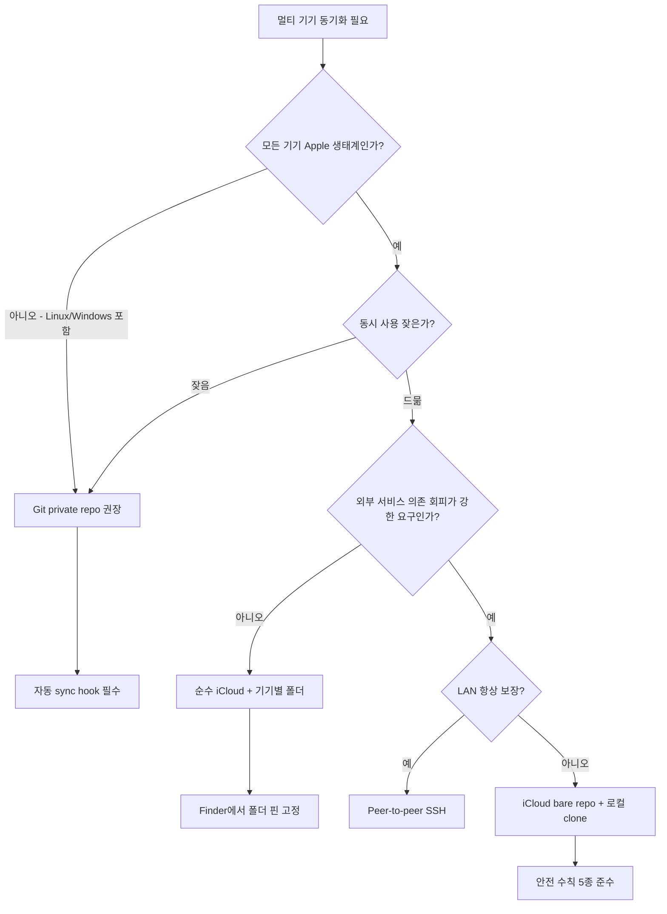

여러 대의 Mac에서 같은 Claude Code 환경을 쓰려고 보니, `~/.claude/` 안의 데이터를 어떻게 공유할지가 문제였다. 단순히 "iCloud에 통째로 올리고 심볼릭 링크"가 첫 번째 떠오르는 발상이지만, 막상 파보면 캐시·세션·로그가 섞여 있어 그대로 옮기면 Claude가 깨진다. 이 글은 의사결정 과정을 통해 **무엇을 공유하고 무엇은 절대 공유하면 안 되는지**, 그리고 동기화 매체로 **iCloud · Git · 둘의 하이브리드** 중 어떤 게 최적인지를 정리한 기록이다.

## 출발: `~/.claude/` 안의 데이터 분류

`~/.claude/`에 있는 항목들을 들여다보면 셋으로 나뉜다.

| 계층 | 예시 | 성격 |
|---|---|---|
| **공유 가치 있음** | `CLAUDE.md`, `qa-history/` | 사람의 자산 (지침·이력) |
| **공유 무의미** | `plans/`, `tasks/`, `todos/` | 진행 중 세션 부산물 |
| **공유 절대 금지** | `sessions/`, `cache/`, `paste-cache/`, `projects/`, `history.jsonl`, `settings.local.json`, `plugins/` | 기기별 세션·캐시·바이너리 |

이 분류가 모든 결정의 출발점이다. 동기화 매체를 무엇으로 고르든, **공유 금지 카테고리는 절대 건드리지 않는다**. 권한 정보가 꼬이거나 세션 상태가 손상되면 Claude Code 자체가 죽는다.

따라서 실제 공유 대상은 사실상 두 가지만 남는다.

- `CLAUDE.md` — 전역 지침. 24KB, 거의 안 바뀐다.
- `qa-history/` — 매일 append되는 Q&A 로그. 누적되며 가치가 커진다.

## 후보 매체 비교

### 1) iCloud Drive + 심볼릭 링크

가장 단순. iCloud Drive 안에 `claude-shared/`를 두고 `~/.claude/`의 일부를 심볼릭 링크.

- 장점: 셋업 후 워크플로 0. 파일 저장 즉시 백그라운드 sync.
- 함정: "Mac 저장공간 최적화"가 켜져 있으면 자주 안 쓰는 파일이 evict되어 placeholder만 남는다. Claude 시작 시 네트워크 대기 또는 실패.
- 함정: 두 기기 동시 사용 시 `qa-history/YYYY-MM-DD.md`에 양쪽이 append → iCloud 충돌 사본(`-conflicted` 또는 `(기기명에서)`) 생성. 데이터 손실은 아니지만 정리 부담.

### 2) Git private repo

`CLAUDE.md`와 `qa-history/`를 git으로 관리. 원격은 GitHub private repo, 또는 자가 호스팅, 또는 로컬만.

- 장점: 명시적 merge, 완전한 history, 어디서나 접근.
- 함정: `qa-history`는 매일 append되는 로그. 매 Q&A마다 commit하면 noise, daily flush로 묶으면 sync 지연. 자동화 없으면 사람 의존도 높음.

### 3) `.git` 자체를 iCloud에 두는 발상

"git의 workflow는 쓰면서, GitHub 같은 외부 서비스도 안 쓰고 싶다" → `.git/`을 iCloud에 두고 main 브랜치를 통합점으로.

이 발상은 **위험하다**. git은 트랜잭션을 가정한다. `.git/index.lock`, refs, pack 파일이 한 단위로 일관되게 변해야 하는데, iCloud는 파일별 비동기 sync다. commit 도중 일부 객체만 sync되면 다른 기기는 dangling 상태로 본다(`error: missing object`). pack 파일이 evict되어도 깨진다. Dropbox·OneDrive·iCloud + `.git` 조합은 수년간 corruption 사례가 누적된 알려진 안티패턴.

다만 **bare repo만** iCloud에 두는 변형은 race 영역이 좁아진다. 작업 tree는 각 기기 로컬, iCloud엔 `.git/`만. push/fetch 순간만 iCloud 접촉한다.

## 의사결정 흐름



가장 많은 케이스(Mac 2~3대, 동시 사용 드묾, GitHub 사용 가능)는 **F안: 순수 iCloud + 기기별 폴더 격리**가 정답이다.

## 충돌을 구조적으로 없애는 핵심 트릭

어떤 매체를 고르든 한 가지 트릭이 모든 충돌을 거의 0으로 만든다.

**`qa-history/`를 기기별 하위 폴더로 격리**한다.

```
claude-shared/
├── CLAUDE.md                           ← 공유 (양쪽 심볼릭 링크)
└── qa-history/
    ├── macbook-pro/2026-05-13.md       ← 이 기기만 씀
    └── imac/2026-05-13.md              ← 저 기기만 씀
```

각 기기는 자기 폴더에만 쓰므로 **같은 파일을 두 기기가 동시에 수정하는 시나리오 자체가 사라진다**. iCloud든 git이든 충돌이 안 난다.

블로그 합성 같은 "여러 날·여러 기기 종합" 작업 시에만 양쪽 폴더를 같이 읽으면 된다. CLAUDE.md의 합성 절차 한 줄만 `qa-history/*/YYYY-MM-DD.md`로 글로빙하도록 수정하면 자동 처리된다.

## 추천 셋업: 순수 iCloud + 기기별 폴더

가장 단순하고 가장 안정적인 조합. 아래는 첫 기기 기준.

```bash
ICLOUD="$HOME/Library/Mobile Documents/com~apple~CloudDocs/claude-shared"
CLAUDE="$HOME/.claude"
DEVICE=$(scutil --get ComputerName | tr ' ' '-' | tr '[:upper:]' '[:lower:]')

mkdir -p "$ICLOUD/qa-history/$DEVICE"

# 백업
cp -R "$CLAUDE" "$CLAUDE.backup-$(date +%Y%m%d)"

# CLAUDE.md 공유
mv "$CLAUDE/CLAUDE.md" "$ICLOUD/CLAUDE.md"
ln -s "$ICLOUD/CLAUDE.md" "$CLAUDE/CLAUDE.md"

# qa-history 기기별 격리
mv "$CLAUDE/qa-history" "$ICLOUD/qa-history/$DEVICE"
ln -s "$ICLOUD/qa-history/$DEVICE" "$CLAUDE/qa-history"
```

두 번째 기기에서는 `DEVICE` 이름만 다르게 설정하고, 기존 데이터를 자기 폴더로 옮긴 뒤 같은 패턴으로 링크.

### iCloud 안전 수칙

1. **Finder에서 "이 Mac에 항상 보관"** — `claude-shared` 폴더 우클릭. 전역 "Mac 저장공간 최적화"는 켜둬도, 이 폴더만 evict 대상에서 제외된다. 일부 폴더만 핀 고정하는 게 핵심.
2. **두 기기 동시 사용 자제** — 기기별 폴더 격리로 데이터 충돌은 막았지만, CLAUDE.md 동시 수정 가능성은 남는다.
3. **백업 유지** — Time Machine에 iCloud 폴더 포함.

## Git을 굳이 쓰고 싶다면

"외부 서비스 0개 + git workflow"가 강한 요구라면 **iCloud bare repo + 로컬 clone**.

```bash
ICLOUD="$HOME/Library/Mobile Documents/com~apple~CloudDocs/claude-shared"
LOCAL="$HOME/claude-shared"

# bare repo (작업 tree 없음, .git 내용만 평평하게 저장)
git init --bare "$ICLOUD/claude-shared.git"

# 작업은 로컬에서
git clone "$ICLOUD/claude-shared.git" "$LOCAL"
```

핵심은 **작업 중엔 로컬만 건드리고, iCloud는 push/fetch 순간만 접촉**한다는 점. 풀 `.git`을 iCloud에 두는 것과 race 영역이 완전히 다르다.

자동 sync는 cron 또는 Claude session hook:

```bash
# crontab
*/15 * * * * cd ~/claude-shared && git pull --rebase --autostash >/dev/null 2>&1 && git add -A && (git diff --cached --quiet || git commit -m "auto $(hostname -s) $(date +%FT%H:%M)") >/dev/null 2>&1 && git push >/dev/null 2>&1
```

두 기기의 cron 시간을 어긋나게(`*/15`와 `7-59/15`) 두면 동시 push가 거의 일어나지 않는다.

추가 안전 수칙:

- bare repo 폴더 Finder 핀 고정 (pack 파일 evict 방지)
- 월 1회 `git fsck --full`로 무결성 검사
- push 직후 30초간 iCloud sync 대기

## 매체별 최종 비교

| 항목 | 순수 iCloud (F) | iCloud bare repo (I) | GitHub private (C) | Peer-to-peer SSH (H) |
|---|---|---|---|---|
| 셋업 비용 | 매우 낮음 | 보통 | 보통 | 보통 |
| 일상 워크플로 | 0 (자동) | cron/hook 필요 | cron/hook 필요 | cron + 네트워크 가용성 |
| append 패턴 적합성 | 좋음 | 보통 | 보통 | 좋음 |
| 충돌 위험 | 낮음 (기기별 격리 시) | 낮음 (cron 어긋남) | 매우 낮음 | 0 |
| 데이터 손상 가능성 | 매우 낮음 | 낮음 (bare 한정) | 0 | 0 |
| 외부 서비스 의존 | iCloud | iCloud | GitHub | 없음 |
| 크로스 플랫폼 | Mac만 | Mac만 | 어디서나 | Mac만 (보통) |
| 버전 history | 없음 | 있음 | 있음 | 있음 |

## 회고

처음엔 "iCloud에 `.claude` 통째로" 같은 발상이 매력적으로 보였다. 하지만 `~/.claude/` 안에 무엇이 들어 있는지 들여다보면 그게 얼마나 위험한지 바로 보인다. **공유할 가치가 있는 데이터는 의외로 적고(CLAUDE.md + qa-history)**, 나머지는 동기화하면 안 되는 것들이다.

매체 선택도 처음 직관과 달랐다. git이 더 "엔지니어링적"으로 보이지만, qa-history의 append 성격은 git workflow와 잘 안 맞는다. 매 Q&A마다 commit하면 noise, 묶어서 flush하면 지연. 자동화로 덮을 수 있지만 그 자동화의 견고성 자체가 짐이 된다. iCloud는 그 짐을 0으로 만든다 — 단, 기기별 폴더 격리라는 한 가지 트릭과 함께.

마지막으로, "외부 서비스 의존 없이 git workflow" 발상은 매력적이지만 `.git`을 iCloud에 직접 두는 건 위험하다. 같은 발상을 **bare repo만 iCloud에 두는 형태**로 변형하면 race 영역이 좁아져 실용 범위로 들어온다. 다만 그 안전 수칙(핀 고정, cron 시간 어긋남, 정기 fsck)을 지킬 의지가 있는가가 결정 기준이다.

결국 동기화 전략은 **데이터의 본성**(append인가 누적인가)과 **사용 패턴**(동시 사용 빈도, 네트워크 가용성)에 맞춰 골라야 한다. 가장 멋있어 보이는 도구가 가장 잘 맞는 도구는 아니다.
