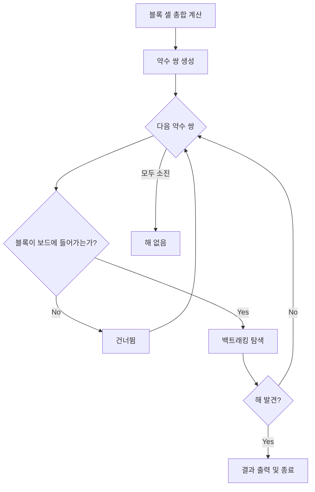
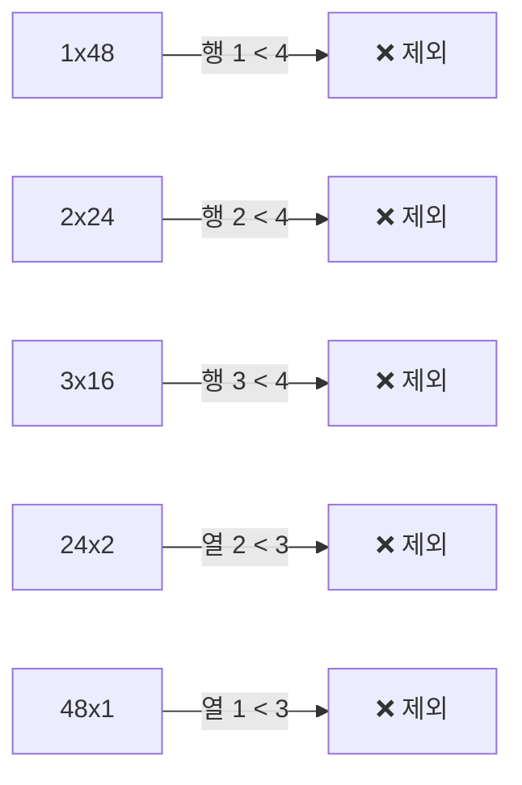

## 배경

블록 퍼즐 솔버에서 보드 크기(행x열)를 사용자가 직접 입력하는 방식은 비효율적이다. 블록 셀 총합에서 가능한 모든 약수 쌍을 자동으로 구하고 순차 탐색하면 사용자 개입 없이 해를 찾을 수 있다.

## 핵심 아이디어



## 구현

### 1. 전체 블록 셀 수 자동 계산

```python
total_cells = sum(np.sum(block.grid) for block in blocks)
```

각 블록의 grid에서 1인 셀의 합계를 구한다. 예시의 A~L 블록은 총 48셀이다.

### 2. 약수 쌍 생성

```python
factor_pairs = []
for i in range(1, total_cells + 1):
    if total_cells % i == 0:
        factor_pairs.append((i, total_cells // i))
```

48의 약수 쌍: `1x48, 2x24, 3x16, 4x12, 6x8, 8x6, 12x4, 16x3, 24x2, 48x1`

### 3. 블록 크기 기반 가지치기

회전 불가이므로 각 블록의 높이/너비는 고정이다. 전체 블록에서 최대 높이와 최대 너비를 구하면, 약수 쌍 생성 시점에서 불가능한 조합을 사전 제거할 수 있다.

```python
min_rows = max(block.grid.shape[0] for block in blocks)  # 최소 필요 행
min_cols = max(block.grid.shape[1] for block in blocks)  # 최소 필요 열

# 약수 쌍 생성 시 바로 필터링
for i in range(1, total_cells + 1):
    if total_cells % i == 0:
        if i >= min_rows and total_cells // i >= min_cols:
            factor_pairs.append((i, total_cells // i))
```

예시에서 블록 C, D, I의 높이가 4이므로 `min_rows=4`, 블록 A, E, F 등의 너비가 3이므로 `min_cols=3`이 된다. 이 조건으로 10가지 약수 쌍 중 5가지를 즉시 제외한다.



### 4. 함수에서 글로벌 변수 제거

`can_place`, `solve` 함수가 글로벌 `ROWS`, `COLS` 대신 `board.shape`에서 직접 크기를 읽도록 수정하여, 다양한 보드 크기에서 재사용 가능하게 했다.

## 실행 결과

```
전체 블록 셀 수: 48
최소 필요 행: 4 (블록 C, D, I)
최소 필요 열: 3 (블록 A, E, F, G, J, L)

전체 약수 쌍: 10가지
  ❌ 1x48    ❌ 2x24    ❌ 3x16
  ✅ 4x12    ✅ 6x8     ✅ 8x6
  ✅ 12x4    ✅ 16x3
  ❌ 24x2    ❌ 48x1

탐색 대상: 5가지 (가지치기로 5가지 제외)

[1/5] 4x12 — ❌ 실패 (1.21초)
[2/5] 6x8  — ✅ 성공! (0.16초)
```

## 정리

| 항목 | 변경 전 | 변경 후 |
|------|---------|---------|
| 보드 크기 | 사용자 하드코딩 | 자동 약수 쌍 탐색 |
| 탐색 범위 | 단일 크기 | 모든 가능한 크기 |
| 함수 의존성 | 글로벌 ROWS/COLS | board.shape 참조 |
| 불가능한 크기 | 실패까지 전체 탐색 | 블록 최대 높이/너비로 사전 제거 |
