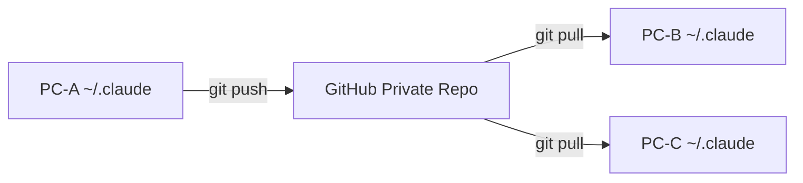
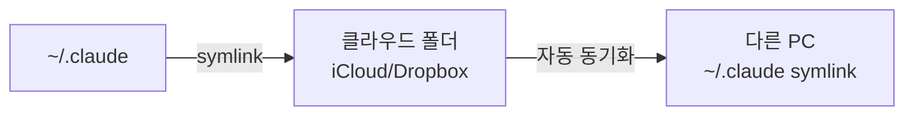

## 문제 상황

Claude Code의 설정 파일들(`~/.claude/`)은 로컬에만 저장된다. 다른 PC에서는 동일한 메모리, 규칙, 키바인딩 등을 사용할 수 없다.

Claude Code에는 **내장 클라우드 동기화 기능이 없다.**

## ~/.claude 디렉토리 구조

```
~/.claude/
├── CLAUDE.md              # 전역 사용자 규칙
├── settings.json          # 전역 설정
├── keybindings.json       # 키바인딩
├── rules/                 # 사용자 규칙 파일들
└── projects/              # 프로젝트별 메모리
    └── <project-path>/
        └── memory/
            └── MEMORY.md  # 자동 메모리 인덱스
```

## 동기화 방법 3가지

### 방법 1: Git Private Repository (추천)



```bash
# 초기 설정 (PC-A)
cd ~/.claude
git init
git remote add origin git@github.com:yourname/claude-dotfiles.git

# 민감 정보 제외
cat > .gitignore << 'EOF'
credentials*
*.token
*.key
EOF

# 동기화
git add -A && git commit -m "sync settings" && git push

# 다른 PC에서 클론
git clone git@github.com:yourname/claude-dotfiles.git ~/.claude
```

**장점**: 버전 이력 관리, 선택적 동기화(`.gitignore`), 클라우드 스토리지 의존 없음

### 방법 2: 심볼릭 링크 + 클라우드 스토리지



```bash
# 실제 데이터를 클라우드 폴더로 이동
mv ~/.claude ~/Library/CloudStorage/Dropbox/.claude

# 심볼릭 링크 생성
ln -s ~/Library/CloudStorage/Dropbox/.claude ~/.claude
```

**장점**: 자동 동기화, 별도 명령 불필요  
**단점**: 클라우드 서비스 의존, 충돌 가능성

### 방법 3: Dotfiles 매니저 (chezmoi)

```bash
# chezmoi로 관리
chezmoi add ~/.claude/settings.json
chezmoi add ~/.claude/CLAUDE.md
chezmoi add ~/.claude/rules/

# 다른 PC에서 적용
chezmoi init --apply yourname
```

**장점**: 다른 dotfile들과 통합 관리  
**단점**: 추가 도구 설치 필요

## 동기화 대상 정리

| 항목 | 동기화 가능 | 비고 |
|------|:---------:|------|
| `CLAUDE.md` | O | 전역 사용자 규칙 |
| `settings.json` | O | 전역 설정 |
| `keybindings.json` | O | 키바인딩 |
| `rules/` | O | 사용자 규칙 |
| `projects/*/memory/` | O | 프로젝트별 메모리 |
| 인증/토큰 파일 | **X** | `.gitignore` 필수 |

## 프로젝트 레벨 설정은 Git으로 자연 공유

프로젝트 루트의 `.claude/CLAUDE.md`와 `.claude/rules/`는 프로젝트 Git에 커밋하면 팀원 및 다른 기기에서 자동으로 공유된다. 별도의 동기화 설정이 필요 없다.

## 결론

Git Private Repository 방식이 가장 실용적이다. 버전 관리, 선택적 동기화, 플랫폼 독립성 모두 충족한다. 인증 관련 파일만 `.gitignore`로 잘 제외하면 된다.
