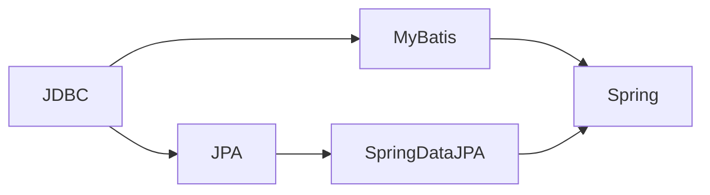
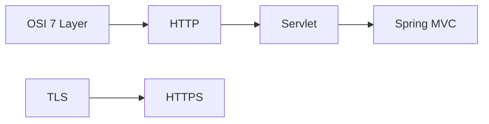
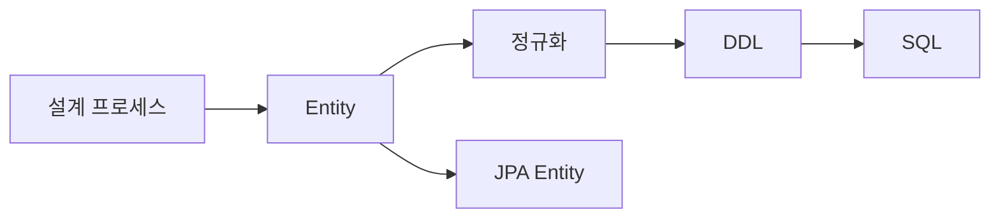
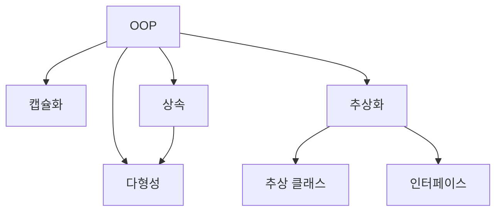
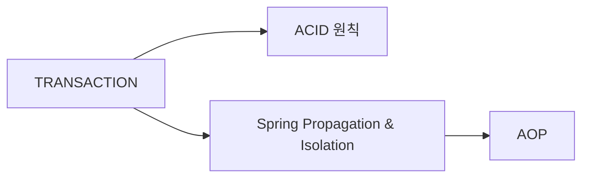

## 개요

Obsidian 기반의 지식 베이스에서 문서 간 교차 참조(Cross-Reference)를 추가하여 연결성을 강화하는 방법을 정리한다.

## 교차 참조의 목적

1. 관련 개념 간 빠른 탐색 지원
2. Obsidian Graph View에서 연결 구조 시각화
3. 학습 시 개념 간 관계 파악 용이

## 위키 링크 형식

```markdown
## 관련 문서
- [[파일이름|표시 텍스트]]
- [[파일이름]]
```

## 교차 참조 전략

### 1. 영속성 계층 (Persistence Layer)



JDBC가 기반이 되고, 그 위에 MyBatis(SQL Mapper)와 JPA(ORM)가 존재하며, Spring Framework와 통합된다.

### 2. 웹 계층 (Web Layer)



Servlet이 Spring MVC의 기반이 되고, HTTP/HTTPS는 OSI 7 Layer의 Application 계층에 위치한다.

### 3. DB 설계-구현 흐름



### 4. OOP 4대 특징



### 5. 트랜잭션 관련



## 적용 기준

- 파일당 3~7개 링크로 제한 (과도한 링크 방지)
- 이미 관련 문서 섹션이 있는 경우 중복 추가하지 않음
- 양방향 링크를 우선 (A에서 B를 링크하면 B에서도 A를 링크)
- 의미 있는 관계만 링크 (단순 키워드 일치가 아닌 개념적 연관)
