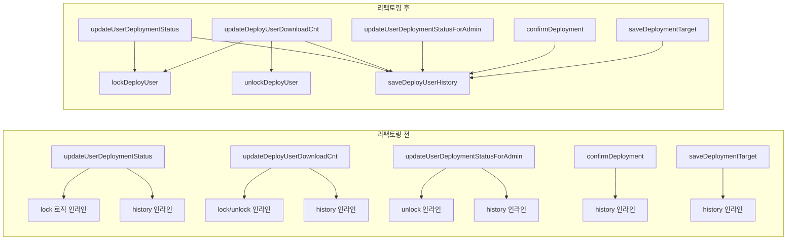

## 배경

DeployService에서 다운로드 횟수 기반 상태 전환, 이력 저장, authKey 생성 로직이 여러 메서드에 걸쳐 중복되어 있었다. 동일 패턴이 3~5곳에서 반복되어 유지보수 시 변경 누락 위험이 있었다.

## 추출한 헬퍼 메서드

### 1. makeUserAuthKey - 포맷 문자열 통합

```java
private static String makeUserAuthKey(Long deployId, Long userId) {
    return String.format("D%d-%d", deployId, userId);
}
```

`String.format("D%d-%d", deployId, userId)` 가 4곳에서 반복 → 1곳으로 통합.

### 2. lockDeployUser / unlockDeployUser - 잠금/해제 통합

```java
private void lockDeployUser(DeployUser du, Long deployId, Long userId) {
    du.setStatus(DeployUserStatus.PUBLISH_STOP.code());
    restfulAPIService.updateFileStatus(makeUserAuthKey(deployId, userId), CConstant.SLEEP_STATUS);
}

private void unlockDeployUser(DeployUser du, Long deployId, Long userId) {
    du.setStatus(DeployUserStatus.DOWNLOAD_SUCCESS.code());
    restfulAPIService.updateFileStatus(makeUserAuthKey(deployId, userId), CConstant.ALIVE_STATUS);
}
```

상태 변경 + 파일 상태 변경이 항상 함께 호출되므로 하나로 묶음.

### 3. saveDeployUserHistory - 이력 저장 통합

```java
private void saveDeployUserHistory(Long deployId, Long userId, String status, Long regId) {
    DeployUserHistory h = new DeployUserHistory();
    h.setDeployId(deployId);
    h.setUserId(userId);
    h.setStatus(status);
    h.setRegId(regId);
    h.setRegDt(LocalDateTime.now());
    deployUserHistoryRepository.save(h);
}
```

6줄짜리 보일러플레이트가 5곳에서 반복 → 1줄 호출로 대체.

## 리팩토링 전후 비교



## 주의 사항

- `updateUserDeploymentStatusForAdmin`의 `PUBLISH` + `ALIVE_STATUS` 조합은 관리자 전용 경로이므로 `unlockDeployUser`와 별도 유지
- `saveDeployUserHistory`는 `LocalDateTime.now()`를 내부에서 호출하므로, 기존 코드에서 미리 캡처한 `now`와 미세한 시간 차이 발생 가능 (실무상 무의미)
