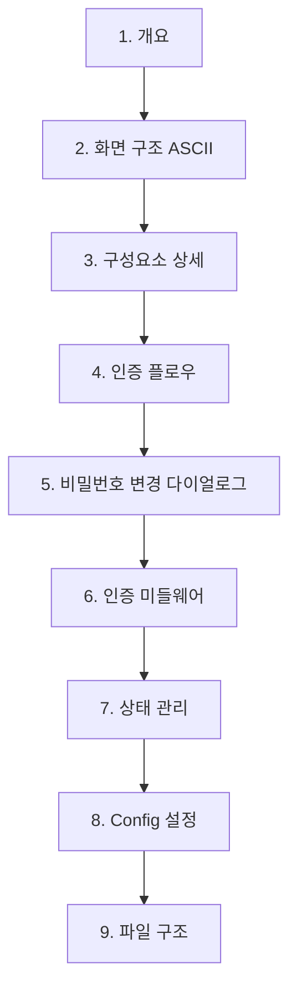

## 배경

관리자 대시보드 프로젝트에서 PPT 기반 화면정의서를 마크다운(design.md) 형태로 전환하는 작업을 진행했다. 첫 번째 예시로 로그인 페이지의 design.md를 작성하고, 이를 기반으로 실제 구현 코드를 매핑했다.

## design.md 구조

로그인 페이지의 design.md는 다음 섹션으로 구성된다:



### 1. 개요
- 페이지 경로, 레이아웃, 사용 컴포넌트, 인증 방식 등 기본 정보

### 2. 화면 구조
- ASCII 아트로 레이아웃 표현 (PPT 대체)

### 3. 구성요소 상세
- 헤더/폼필드/기능/버튼/안내문구 등 각 요소를 테이블로 정리

### 4. 인증 플로우
- Mermaid sequenceDiagram으로 전체 인증 흐름 시각화

### 5~9. 부가 상세
- 다이얼로그, 미들웨어, 상태관리, 설정, 파일 구조

## 핵심: Config-Driven 패턴

이 프로젝트는 `LLogin` 공통 컴포넌트에 `ILoginConfig`를 전달하는 Config-Driven 패턴을 사용한다.

```typescript
const loginConfig: ILoginConfig = {
  title: '로그인',
  appName: runtimeConfig.public.APP_NAME,
  fields: { id: { placeholder: 'Id' }, password: { placeholder: 'Password' } },
  rememberIdEnabled: true,
  certConfig: { enabled: true },
  onSubmit: async (id, password) => { /* 인증 처리 */ }
};
```

design.md에서 이 설정값들을 명시하면, 구현 시 그대로 코드에 반영할 수 있다.

## design.md의 장점 (vs PPT)

| 항목 | PPT | design.md |
|------|-----|-----------|
| 버전 관리 | 파일 통째로 교체 | Git diff로 변경 추적 |
| 검색 | 불가 | grep/IDE 검색 가능 |
| 코드 연동 | 수동 비교 | 파일 경로/타입 직접 참조 |
| 다이어그램 | 도형 수동 배치 | Mermaid 코드로 자동 렌더링 |
| 협업 | 메일로 공유 | PR 리뷰로 협업 |

## 파일 구조 규칙

```
docs/pages/{페이지명}/design.md
```

예: `docs/pages/login/design.md`, `docs/pages/dashboard/design.md`
