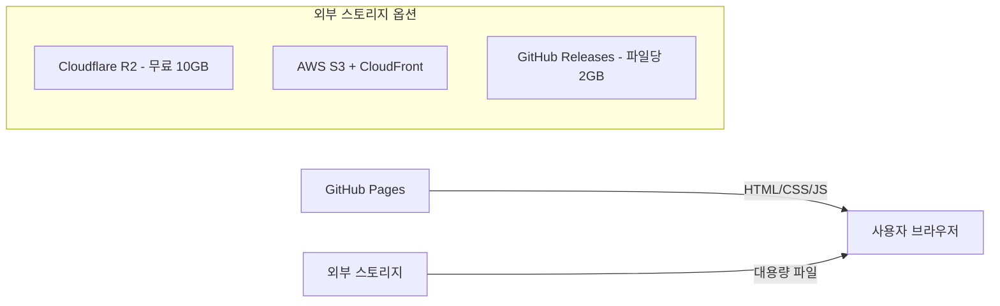
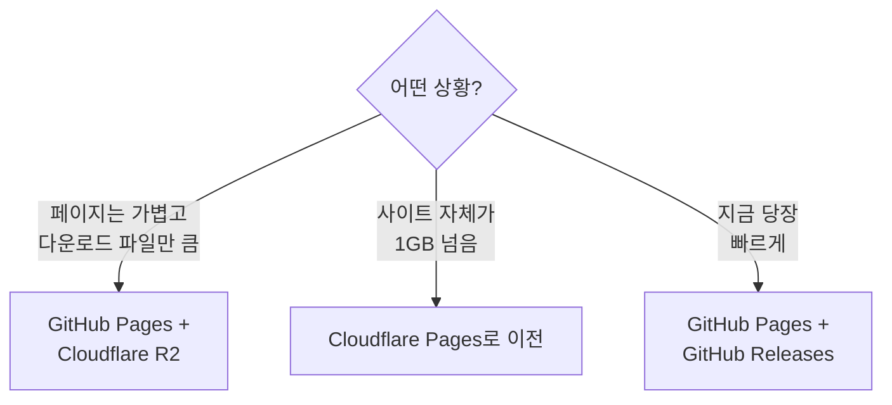

## GitHub Pages 제한 사항

GitHub Pages에는 아래 3가지 제한이 있다.

| 항목 | 제한 |
|------|------|
| 리포지토리 크기 | 1GB (권장) |
| 사이트 크기 | 1GB |
| 월 대역폭 | 100GB |

1GB 이상의 콘텐츠를 서빙해야 한다면 다음 방법을 고려해야 한다.

## 방법 1: 대용량 파일을 외부 스토리지로 분리

페이지 자체는 GitHub Pages에 두고, 대용량 파일(영상, 바이너리, 데이터셋 등)만 외부에서 서빙한다.



### 외부 스토리지 비교

| 스토리지 | 무료 범위 | 이그레스 비용 | 특징 |
|----------|----------|-------------|------|
| Cloudflare R2 | 10GB 저장 | 무료 | 대역폭 무제한, 가성비 최고 |
| GitHub Releases | 파일당 2GB | 무료 | 같은 repo에서 관리 가능, 설정 불필요 |
| AWS S3 | 12개월 5GB | 유료 | CloudFront 연동으로 빠른 전송 |
| Backblaze B2 | 10GB | Cloudflare 경유 시 무료 | Cloudflare CDN과 무료 연동 가능 |

### 사용 예시

```html
<!-- GitHub Pages의 HTML에서 외부 파일 참조 -->
<a href="https://your-r2.example.com/large-file.zip">다운로드</a>
<video src="https://your-r2.example.com/demo.mp4"></video>
```

## 방법 2: GitHub Pages 대신 다른 호스팅 사용

사이트 자체가 1GB를 넘는다면 호스팅 플랫폼을 변경하는 것이 낫다.

| 플랫폼 | 무료 제한 | 배포 방식 | 특징 |
|--------|----------|----------|------|
| Cloudflare Pages | 무제한 대역폭, 빌드 500회/월 | Git push | GitHub Pages와 거의 동일 |
| Vercel | 100GB 대역폭 | Git push | Next.js 최적화 |
| Netlify | 100GB 대역폭 | Git push | 빌드 설정 유연 |

Cloudflare Pages가 대역폭 무제한이라 가장 직접적인 대안이다.

## 방법 3: Git LFS (비추천)

Git LFS로 대용량 파일을 관리할 수 있지만, GitHub Pages 빌드 시 LFS 파일을 제대로 서빙하지 못하는 문제가 있어 권장하지 않는다.

## 상황별 추천


