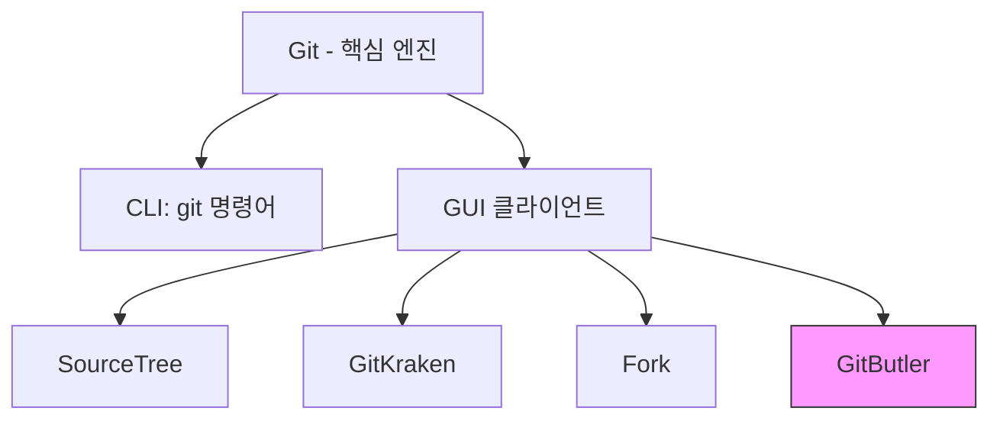
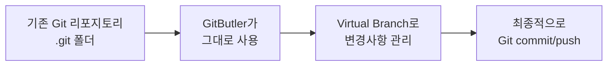
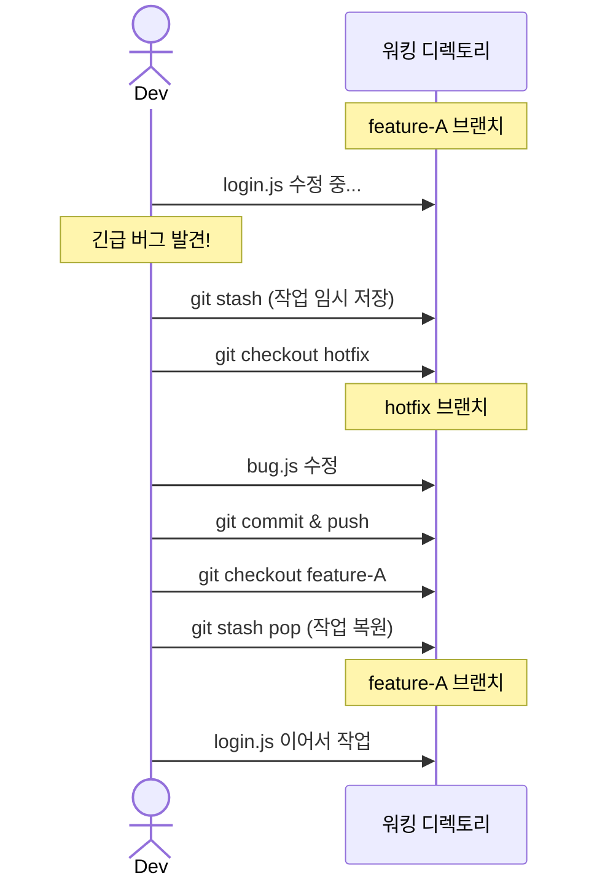
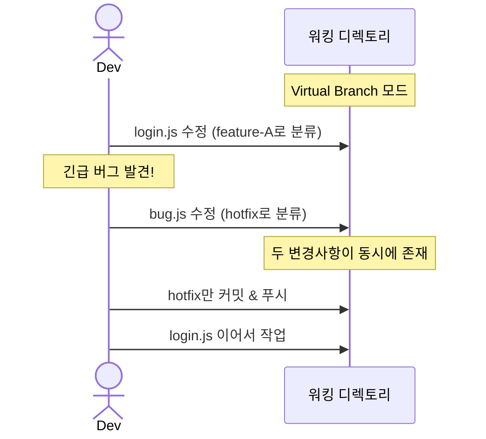
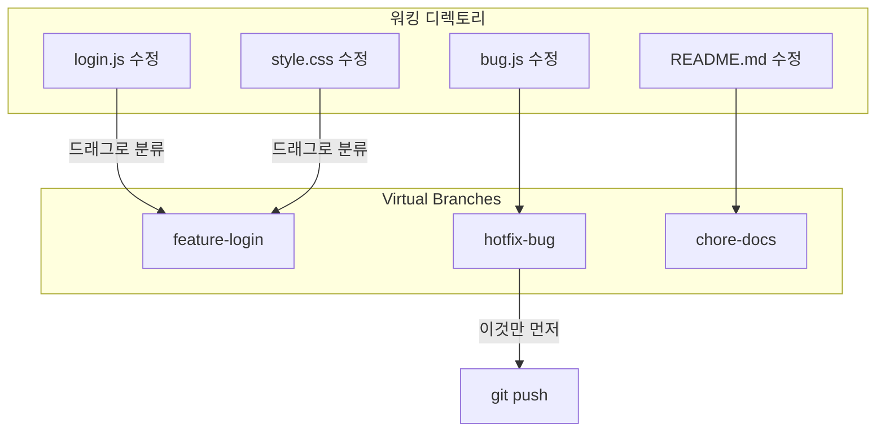

## GitButler란

GitButler는 Git을 **대체**하는 도구가 아니라, Git **위에서 동작하는 GUI 클라이언트**다. SourceTree, GitKraken, Fork 등과 같은 카테고리에 속하지만, "Virtual Branches"라는 독자적인 개념으로 차별화된다.

## 핵심 차별점: Virtual Branches

일반적인 Git 워크플로우에서는 브랜치를 전환하려면 `git checkout` 또는 `git switch`가 필요하고, 작업 중인 변경사항은 stash하거나 commit해야 한다.

GitButler의 Virtual Branches는 **하나의 워킹디렉토리에서 여러 브랜치의 변경사항을 동시에 관리**할 수 있게 해준다.

| 기능 | 일반 Git 클라이언트 | GitButler |
|------|-------------------|-----------|
| 가상 브랜치 | 브랜치 전환 시 stash/commit 필요 | 여러 브랜치 작업을 동시에 유지 |
| 변경 분류 | 수동으로 stage/commit | 변경사항을 드래그로 브랜치별 분류 |
| 브랜치 전환 | checkout 필요 | 전환 없이 동시 작업 |

## Git과의 관계

- 내부적으로 기존 `.git` 폴더를 그대로 활용
- 기존 Git 리포지토리를 바로 열어서 사용 가능
- 최종 결과물은 일반 Git commit과 동일

비유하자면 Git은 엔진이고, GitButler는 그 엔진 위에 올린 새로운 UX의 자동차다.

## Virtual Branch 상세

### 일반 Git 워크플로우의 문제

일반 Git에서 브랜치를 전환하려면 반드시 현재 작업을 정리해야 한다.

브랜치 전환마다 stash → checkout → pop을 반복해야 하고, 컨텍스트 스위칭 비용이 크다.

### Virtual Branch 워크플로우

checkout/stash 없이 파일 단위로 브랜치를 분류한다.

### 동작 방식

| 단계 | 설명 |
|------|------|
| 1. 파일 수정 | 브랜치 신경 쓰지 않고 자유롭게 수정 |
| 2. 분류 | 변경된 파일을 드래그해서 원하는 Virtual Branch에 배치 |
| 3. 선택적 커밋 | 준비된 브랜치만 독립적으로 commit & push |

### 일반 브랜치와 비교

| | Git Branch | Virtual Branch |
|--|-----------|----------------|
| 동시 존재 | 1개만 활성 | 여러 개 동시 활성 |
| 전환 방법 | checkout/switch | 전환 불필요 |
| 미완성 작업 처리 | stash 필요 | 그대로 두면 됨 |
| 파일 분류 | commit 시점에 결정 | 수정 즉시 드래그로 분류 |
| 선택적 push | cherry-pick 등 필요 | 브랜치별 독립 push |
| 내부 구현 | .git/refs | GitButler 자체 관리 → 최종 Git commit 생성 |

### 주의할 점

- 같은 파일의 같은 부분을 두 Virtual Branch에서 수정하면 충돌 발생
- GitButler 없이 다른 환경에서 열면 일반 Git 상태로 보임
- 팀원이 GitButler를 안 쓰더라도 push된 결과는 일반 Git branch와 동일

한마디로 "checkout 없이 멀티태스킹하는 Git"이다.
